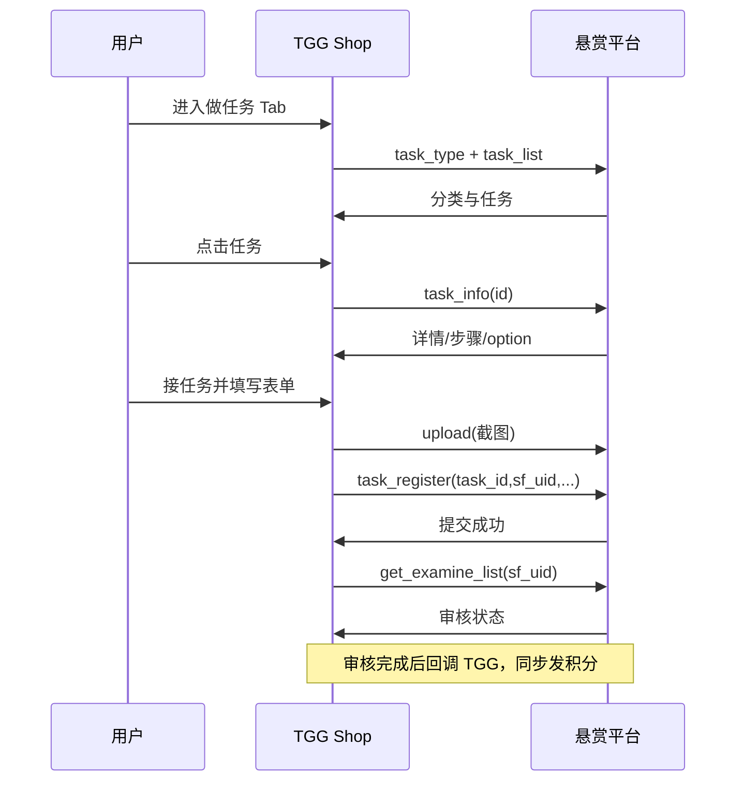

# 悬赏平台 API 对接说明

> 来源：`api接口文档 (4).pdf`  
> 实现代码：`app/js/task-api.js`、`app/earn-points.html`

---

## 1. 基础配置

| 项 | 说明 |
|----|------|
| 协议 | HTTP POST，Restful 风格 |
| 编码 | UTF-8 |
| Content-Type | multipart/form-data |
| 响应格式 | `{ code: 0, msg, data }`，code=0 成功 |

### 鉴权 sign

```
sign = MD5( Ymd + appid + key ).toLowerCase()
```

示例（PHP）：`md5(date("Ymd").$appid.$key)`

配置位置：复制 `app/js/config.example.js` 为 `config.js`，填写 `baseUrl`、`appid`、`key`、`sfUid`。

---

## 2. 接口清单

| 编号 | 接口 | URI | 用途 |
|------|------|-----|------|
| — | 上传图片 | `/api/common/upload` | 提交任务截图 |
| 2.1 | 任务列表 | `index/index/task_list` | 做任务列表页 |
| 2.2 | 任务分类 | `index/index/task_type` | 分类 Tab |
| 2.3 | 任务详情 | `index/index/task_info` | 详情 + 接任务 |
| 2.4 | 提交任务 | `index/index/task_register` | 会员交单 |
| 2.5 | 审核列表 | `index/index/get_examine_list` | 我的提交 |
| 2.6 | 审核详情 | `index/index/get_examine_info` | 单条审核详情 |
| 2.7 | 回调 | — | 平台服务端接收审核结果 |

---

## 3. 赚积分页结构（APP）

```
赚积分 Tab
├── 做任务
│   ├── 拉新任务入口（TGG 自有，列表不展示积分）
│   ├── 分类筛选 ← task_type
│   ├── 任务列表 ← task_list（列表不展示 reward）
│   ├── 任务详情 ← task_info
│   ├── 提交任务 ← task_register + upload
│   ├── 我的提交 ← get_examine_list
│   └── 我的邀请码 ← invite/info + invite/list（§4.5）
└── 签到（TGG 自有逻辑）
    ├── 签满30天奖励文案（后台配置）
    ├── 随机 N 组广告（每组 1 激 + 1 插，N 在 min–max 间随机）
    ├── 看完 → 抽奖券 ×1
    └── 转盘抽奖（奖品/权重后台配置）← signin API（§4.6）
```

---

## 9. TGG 签到 API

> 实现：`app/js/signin-api.js`

| 接口 | URI | 用途 |
|------|-----|------|
| 签到状态 | `api/signin/status` | 今日组数、连续天数、是否可抽奖 |
| 开始签到 | `api/signin/start` | 生成/恢复当日广告任务 |
| 广告完成 | `api/signin/ad_complete` | 上报激/插看完（ad_type: ji/cha） |
| 抽奖 | `api/signin/lottery_spin` | 消耗抽奖券，权重随机出奖 |

**广告组示例**：后台 3–5 组，今日随机 4 → 用户看 4 激 + 4 插 → 获得抽奖券 → 转盘随机奖励。

---

## 8. TGG 邀请 API（拉新）

> 与悬赏平台 **独立**。实现：`app/js/invite-api.js`  
> 需求详述：需求文档 §3.2.3、§4.5

| 接口 | URI | 用途 |
|------|-----|------|
| 邀请信息 | `api/invite/info` | 邀请码、奖励规则、累计数据 |
| 邀请列表 | `api/invite/list` | 我邀请的好友及贡献积分 |
| 邀请统计 | `api/invite/stats` | 月度/累计统计（可选） |

本地预览：`useMock: true` 时使用 Mock；对接真实环境需 `tggApiUrl` + 登录 `token`。

**列表 vs 详情展示**：
- 做任务 Tab 顶部「拉新任务」卡片：**不展示**具体积分/比例
- 「我的邀请码」页：**展示** reward_invite、reward_ratio 等规则

---

## 4. 会员接任务流程



---

## 5. 关键字段

### task_list 列表项

| 字段 | 说明 | 列表页展示 |
|------|------|------------|
| id | 任务 ID | — |
| title | 任务名称 | ✓ |
| image | 小图 | ✓ |
| c_name | 分类名 | ✓ |
| tishi | 提醒 | ✓ |
| reward | 任务金额 | ✗（详情页展示） |
| users_ratio | 会员可得 | ✗（详情页展示） |
| option | 提交字段 | ✗ |

### task_register 提交

| 字段 | 必须 | 说明 |
|------|------|------|
| appid | 是 | 合作商 ID |
| task_id | 是 | 任务 ID |
| sf_uid | 是 | TGG 平台用户 UID |
| sign | 是 | 签名 |
| name/mobile/text1/text2 | 否 | 按 option 动态 |
| images | 否 | 多图逗号分隔 |

### get_examine_list status

| 值 | 含义 |
|----|------|
| All | 全部 |
| 0 | 审核中 |
| 1 | 审核通过 |
| 2 | 审核失败 |

---

## 6. 本地预览

1. 打开 `app/earn-points.html`（默认 `useMock: true` 使用 Mock 数据）
2. 配置真实密钥：创建 `config.js`，设置 `useMock: false`
3. 若遇 CORS，需 TGG 后端做 API 代理转发

---

## 7. 回调对接（2.7）

悬赏平台审核完成后 POST 回调至 TGG 服务端：

```json
{
  "id": "1732",
  "sf_uid": "13",
  "status": "1",
  "remarks": ""
}
```

TGG 响应：`{"status":"success"}`，并同步给用户发积分、邀请人 10% 提成。
