# TGG Shop 流程原型

> **版本**：v1.0  
> **日期**：2026-06-22  
> **说明**：本文档为 TGG Shop 业务流程与页面跳转原型，供产品、设计、开发评审使用。  
> **配套文件**：`流程原型.html`（浏览器可视化查看）

---

## 目录

1. [APP 页面导航架构](#1-app-页面导航架构)
2. [用户注册与会员](#2-用户注册与会员)
3. [购物下单主流程](#3-购物下单主流程)
4. [支付方式分支](#4-支付方式分支)
5. [自提点选择](#5-自提点选择)
6. [订单状态与核销](#6-订单状态与核销)
7. [代理核销流程](#7-代理核销流程)
8. [赚积分流程](#8-赚积分流程)
9. [邀请分销流程](#9-邀请分销流程)
10. [会员开通与续费](#10-会员开通与续费)
11. [退货退款流程](#11-退货退款流程)
12. [代理申请流程](#12-代理申请流程)
13. [后台任务审核对接](#13-后台任务审核对接)

---

## 1. APP 页面导航架构

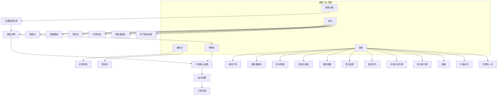

### 页面跳转说明

| 起点 | 操作 | 目标页面 |
|------|------|----------|
| 首页 | 点击搜索栏 | 搜索页 → 商品列表 → 商品详情 |
| 首页 | 签到/做任务/邀请好友 | 签到页 / 任务列表 / 我的邀请码 |
| 商城分类 | 选择分类 | 分类商品列表 → 商品详情 |
| 商品详情 | 加入购物车 | 购物车 |
| 商品详情 | 立即购买 | 订单确认/结算 |
| 购物车 | 去结算 | 订单确认/结算 |
| 我的 | 我的订单 | 待收货 / 已收货 列表 → 订单详情 |
| 我的 | 申请点位代理 | 代理申请页（提交后等待审核） |
| 代理用户 | 扫一扫 | 扫码核销页 |

---

## 2. 用户注册与会员

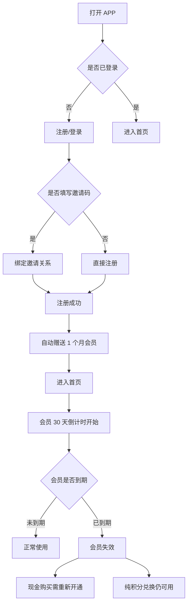

### 关键规则

| 节点 | 规则 |
|------|------|
| 新用户注册 | 当天起赠送 1 个月会员 |
| 邀请码 | 可选填，填写后与邀请人建立绑定 |
| 会员到期 | 需重新开通才能使用现金购买 |
| 积分保留 | 到期前累计积分保留（使用细则待确认） |

---

## 3. 购物下单主流程

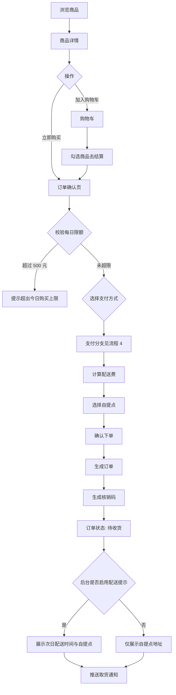

### 页面串联

```
首页/分类/搜索 → 商品详情 → [购物车] → 订单确认页 → 支付 → 支付结果 → 订单详情
                                      ↘ 立即购买 ↗
```

### 配送费计算

| 订单金额 | 默认配送费 |
|----------|------------|
| ≤ 100 元 | 3 元 |
| 101–200 元 | 6 元 |
| 后台可配置 | 可关闭或自定义档位 |

---

## 4. 支付方式分支

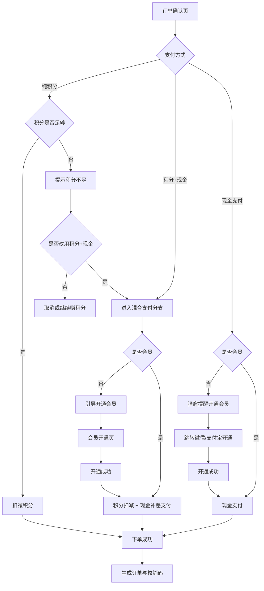

### 支付规则矩阵

| 支付方式 | 需要会员 | 价格 | 积分不足时 |
|----------|----------|------|------------|
| 纯积分 | 否 | 会员价 | 不可下单，可引导混合支付 |
| 现金 | 是 | 会员价 | — |
| 积分+现金 | 是 | 会员价 | 积分部分 + 现金补差 |

---

## 5. 自提点选择

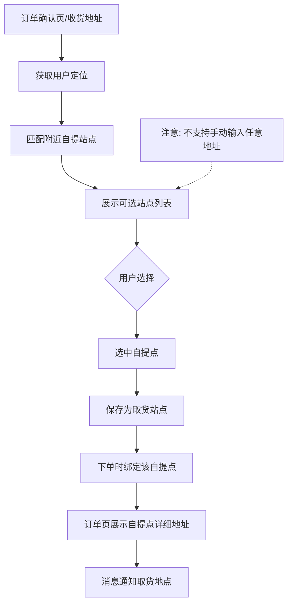

### 交互约束

- 类似快递站模式：从系统预设站点中选择
- 根据定位推荐，如「师大」→「师大站点」
- 可绑定常用地址，但取货仍以自提点为准

---

## 6. 订单状态与核销

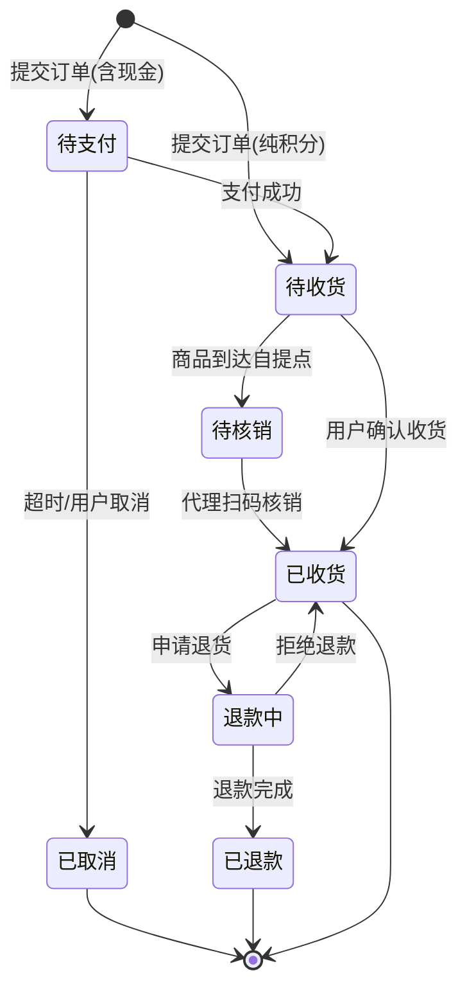

### 用户可见状态（参考淘宝）

| 展示状态 | 说明 |
|----------|------|
| 待收货 | 含待支付、配送中、待核销 |
| 已收货 | 核销完成或确认收货 |

---

## 7. 代理核销流程

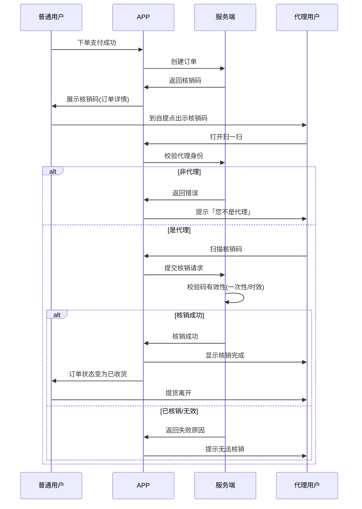

### 角色行为

| 角色 | 入口 | 行为 |
|------|------|------|
| 普通用户 | 订单详情 | 查看/展示核销码 |
| 代理用户 | 我的 → 扫一扫 | 扫码核销 |
| 非代理 | 扫一扫 | 提示「您不是代理」 |

---

## 8. 赚积分流程

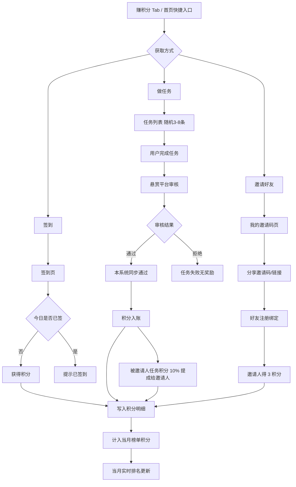

---

## 8.1 积分排行榜月度结算

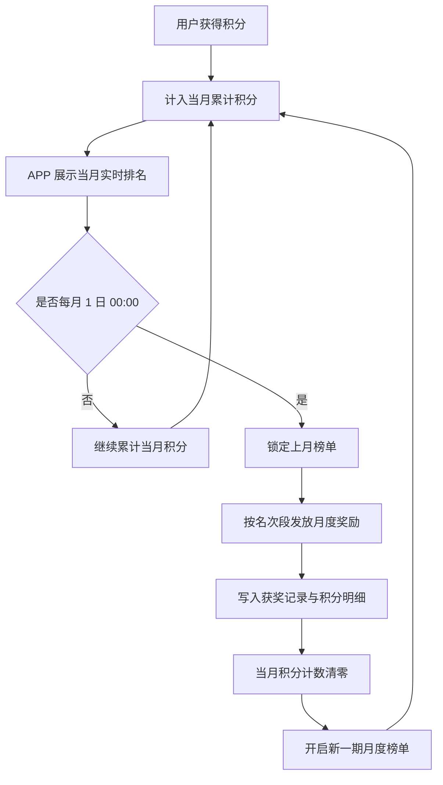

### 周期说明

| 节点 | 规则 |
|------|------|
| 统计口径 | 仅统计 **当月入账积分** |
| 结算时间 | 每月 1 日 00:00 |
| 奖励频率 | **每月一次**，对上一自然月定榜发奖 |
| 重置 | 结算后新一期从 0 开始重新累计 |

---

## 9. 邀请分销流程

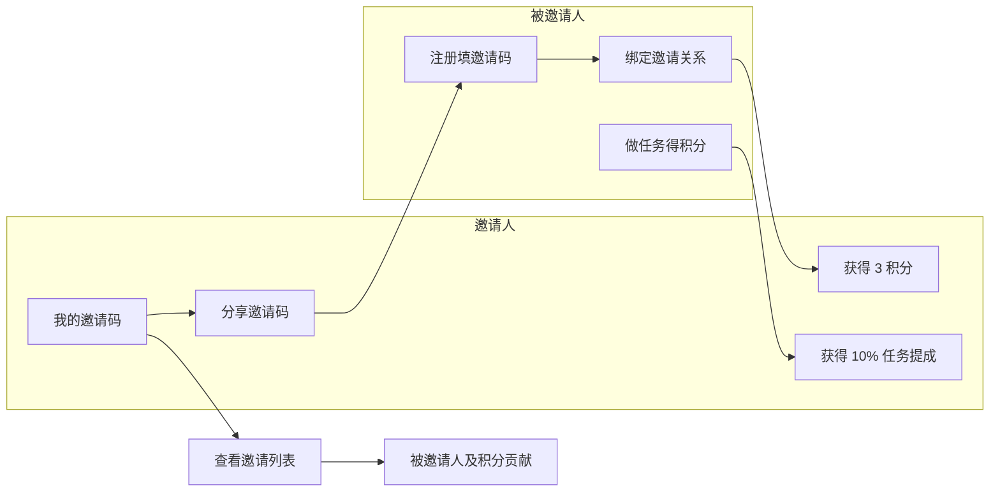

### 奖励规则（默认，后台可配）

| 事件 | 邀请人奖励 |
|------|------------|
| 被邀请人注册成功 | 3 积分 |
| 被邀请人完成任务得积分 | 任务积分的 10% |

---

## 10. 会员开通与续费

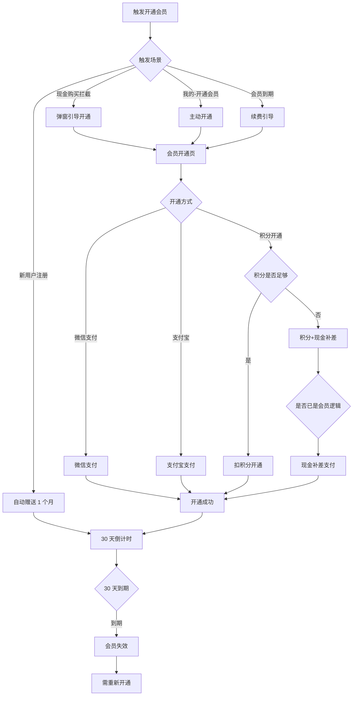

---

## 11. 退货退款流程

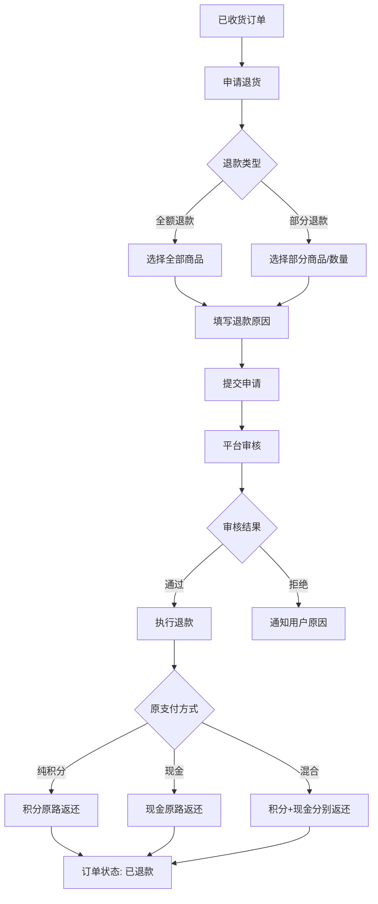

> 参考：朴朴、美团退货流程

---

## 12. 代理申请流程

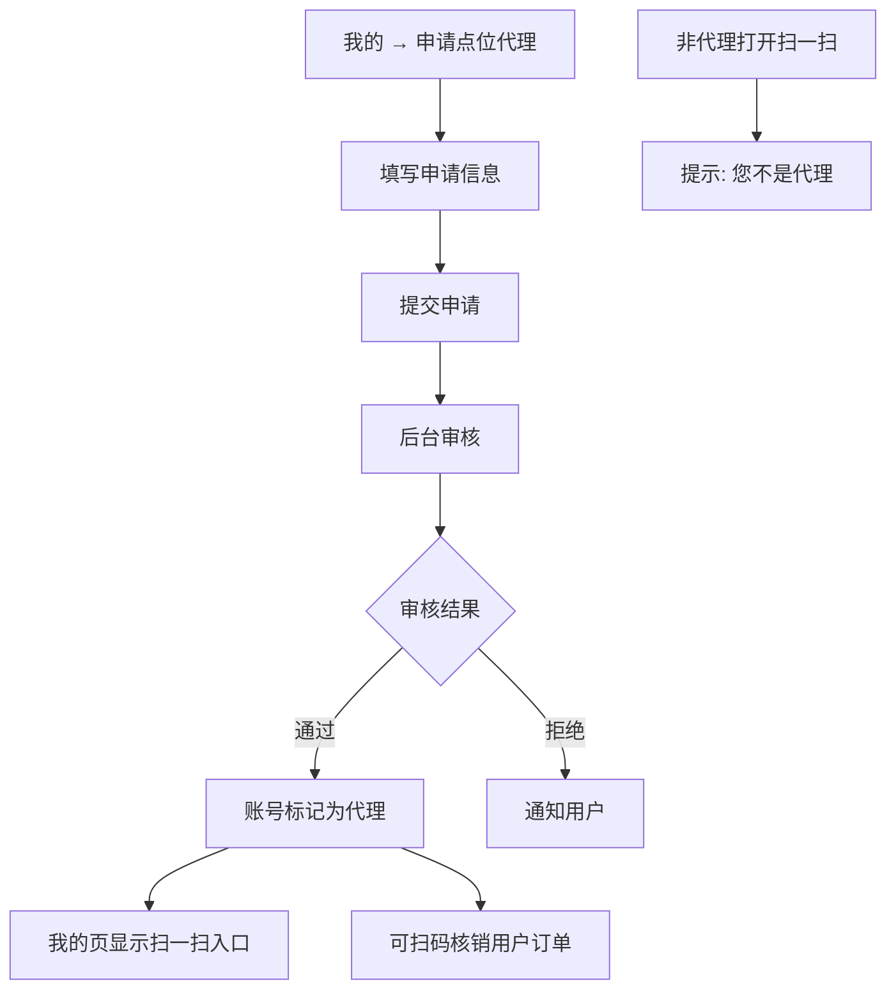

---

## 13. 后台任务审核对接

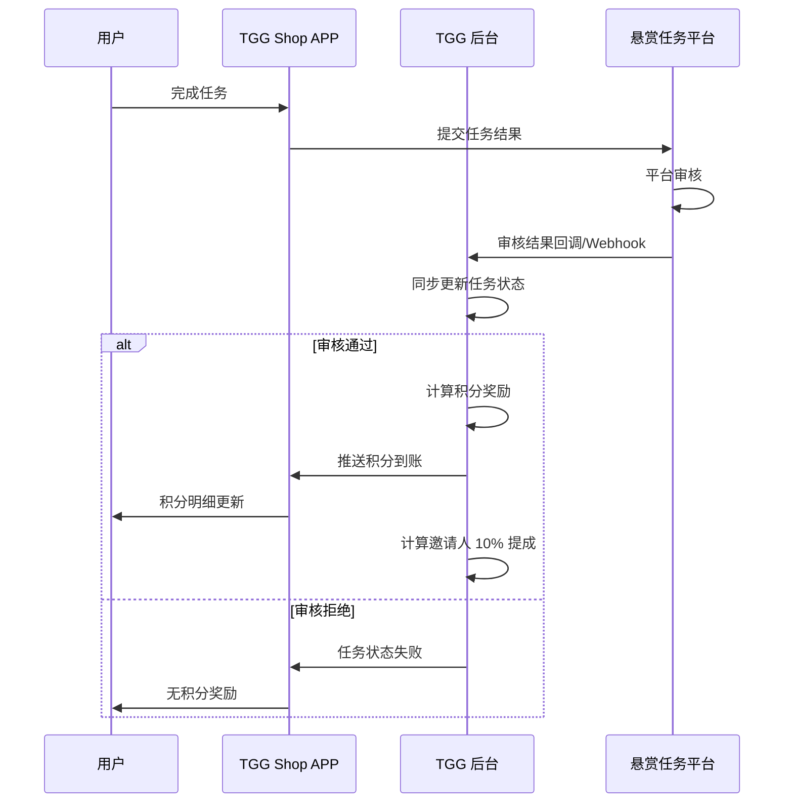

---

## 附录：流程与页面对照

| 流程 | 涉及页面 |
|------|----------|
| 购物下单 | 商品详情、购物车、订单确认、支付结果、订单详情 |
| 代理核销 | 订单详情（核销码）、代理扫一扫 |
| 赚积分 | 赚积分 Tab、任务列表、签到页、积分明细 |
| 邀请分销 | 我的邀请码、注册页 |
| 会员 | 开通会员页、我的（会员状态） |
| 退货 | 订单详情、退货申请页 |
| 自提点 | 订单确认页、收货地址/自提点选择 |

---

## 版本记录

| 版本 | 日期 | 说明 |
|------|------|------|
| v1.0 | 2026-06-22 | 基于《需求文档.md》首次生成 |
