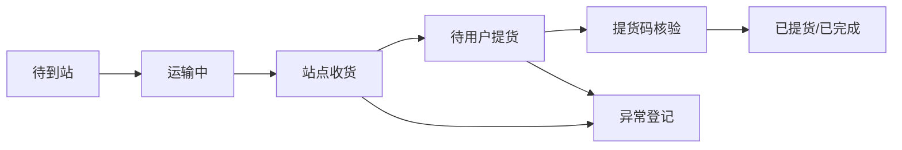

# TGG Shop 站点端功能文档

> 文档版本：V1.0  
> 编写日期：2026-09-22  
> 适用端：TGG Shop 自提站点端  
> 主要用户：站点管理员、站点工作人员、运营管理员

## 1. 文档目的

站点端用于处理自提订单的站内履约，完成货物收货、入站登记、站内保管、用户提货核验和异常登记。

站点端不承担商城购物、商品上架、财务审批、积分调整和全局订单运营。用户负责下单和查看取货信息，运营后台负责配置站点和处理跨站异常，站点端负责现场履约。

## 2. 业务范围

### 2.1 包含功能

- 站点工作人员登录和权限控制；
- 查看本站待收货、待提货和异常订单；
- 扫码或输入订单号完成收货；
- 登记到站时间、货物数量、货损和储位；
- 查看站内待提货订单；
- 扫描取货码或输入订单号完成用户提货核验；
- 记录收货、提货和异常操作日志；
- 提供逾期、错站、缺货、货损和取货码无效处理入口。

### 2.2 不包含功能

- 商品价格、库存金额和商品上下架维护；
- 用户积分、会员状态和支付金额修改；
- 退款、提现和财务审批；
- 配送人员调度和送货上门订单管理；
- 跨站订单转移和全局运营报表。

## 3. 角色与权限

| 角色 | 查看本站订单 | 收货 | 提货核验 | 登记异常 | 查看日志 | 修改站点配置 |
| --- | --- | --- | --- | --- | --- | --- |
| 站点工作人员 | 是 | 是 | 是 | 是 | 仅本人/当班 | 否 |
| 站点管理员 | 是 | 是 | 是 | 是 | 是 | 仅本站基础信息 |
| 运营管理员 | 全部站点 | 可处理 | 可处理 | 可处理 | 全部 | 是 |

所有站点数据必须按 `siteId` 隔离。站点人员不能通过修改 URL、订单号或请求参数访问其他站点数据。

## 4. 订单状态

### 4.1 站点履约状态

```text
expected       待到站
in_transit     运输中
received       已收货
ready          待用户提货
picked_up      已提货
completed      已完成
exception      异常
```

### 4.2 正常状态流转



站点端不能跳过收货直接完成提货。订单处于未支付、已取消、退款中、已退款或关闭状态时，不能收货或提货。

## 5. 页面结构

### 5.1 登录页

功能：

- 账号、密码或验证码登录；
- 登录后加载工作人员身份和授权站点；
- 多站点人员选择当前作业站点；
- 退出登录、会话过期和重新登录；
- 连续登录失败时锁定并提示联系运营管理员。

登录成功后只允许进入授权站点，不能在前端手动切换到未授权站点。

### 5.2 工作台

展示内容：

- 当前站点名称、地址、营业状态和联系电话；
- 待收货数量；
- 运输中数量；
- 已收货待提货数量；
- 今日已提货数量；
- 异常订单数量；
- 逾期未提货数量；
- 最后同步时间和网络状态。

快捷操作：

- 扫码收货；
- 手动收货；
- 扫码提货；
- 查询订单；
- 登记异常。

### 5.3 待收货列表

筛选条件：

- 订单号；
- 用户手机号后四位；
- 订单日期；
- 运输状态；
- 批次号；
- 商品名称。

列表字段：

- 订单号；
- 用户脱敏信息；
- 商品数量；
- 预计到站时间；
- 当前订单状态；
- 当前站点；
- 操作按钮：查看、收货、登记异常。

### 5.4 收货详情

展示字段：

- 订单号和支付/积分状态；
- 用户昵称和脱敏手机号；
- 商品名称、规格和数量；
- 自提点名称和地址；
- 运输批次和预计到站时间；
- 历史操作记录。

收货操作：

1. 扫描订单码或输入订单号；
2. 服务端校验订单归属、支付状态、履约方式和当前状态；
3. 工作人员核对实物数量；
4. 选择货物状态：正常、缺货、货损、数量不符；
5. 填写储位号和备注；
6. 确认收货；
7. 成功后订单变为“待用户提货”。

收货按钮在请求期间必须禁用，成功和失败结果都要明确展示。

### 5.5 待提货列表

列表字段：

- 订单号；
- 用户脱敏昵称和手机号后四位；
- 商品件数；
- 储位号；
- 到站时间；
- 保管时长；
- 提货截止时间；
- 当前状态。

支持按待提货、今日到站、即将逾期、已逾期和异常筛选。

### 5.6 提货核验页

核验方式：

- 扫描用户订单取货码；
- 手动输入取货码；
- 输入订单号后再输入取货码；
- 不允许只凭手机号直接完成提货。

核验成功前展示：

- 订单号；
- 自提点名称；
- 用户脱敏信息；
- 商品和数量；
- 到站时间；
- 订单支付状态；
- 是否已登记异常。

确认提货后记录：

- 提货时间；
- 提货操作人；
- 站点 ID；
- 核验方式；
- 设备或会话标识；
- 操作结果。

### 5.7 异常登记页

异常类型：

- 错站订单；
- 订单未找到；
- 未支付；
- 重复收货；
- 商品缺失；
- 商品破损；
- 数量不符；
- 取货码无效；
- 用户信息不一致；
- 超期未提；
- 系统或设备故障。

异常字段：

- 订单号；
- 异常类型；
- 实际数量；
- 文字说明；
- 图片凭证；
- 联系方式；
- 操作人和提交时间。

站点人员只能登记异常，不能自行修改订单金额、补发积分、审批退款或关闭异常。

### 5.8 操作日志页

日志包含：

- 操作时间；
- 操作人；
- 站点；
- 订单号；
- 操作类型；
- 请求结果；
- 失败原因；
- 幂等键；
- 设备和会话信息。

日志只允许追加，不允许站点人员删除或修改。

## 6. 关键业务流程

### 6.1 收货流程

```text
扫描订单/批次
→ 校验当前站点
→ 校验订单已支付或积分已扣减
→ 校验订单为自提订单
→ 核对商品数量和状态
→ 填写储位和备注
→ 提交收货
→ 写入站点履约记录
→ 更新用户端为“已到站待提货”
```

以下情况必须拒绝收货：

- 订单不属于当前站点；
- 订单未支付或积分未扣减；
- 订单已取消、退款或关闭；
- 订单已收货；
- 订单为配送订单；
- 商品或数量校验失败。

### 6.2 用户提货流程

```text
扫描取货码
→ 校验取货码和订单匹配
→ 校验当前站点
→ 校验订单为待提货
→ 展示商品明细
→ 工作人员确认交付
→ 写入提货日志
→ 更新订单为已提货/已完成
→ 用户端同步状态
```

以下情况必须拒绝提货：

- 取货码错误、过期或已使用；
- 订单不属于当前站点；
- 订单未完成支付；
- 订单已取消、退款或关闭；
- 订单尚未完成收货；
- 订单已经提货。

## 7. 接口规划

站点端使用独立接口，不直接调用后台管理接口：

```text
POST /api/station/auth/login
POST /api/station/auth/logout
GET  /api/station/me
GET  /api/station/dashboard
GET  /api/station/orders
GET  /api/station/orders/:orderId
POST /api/station/orders/:orderId/receive
POST /api/station/orders/:orderId/pickup-verify
POST /api/station/orders/:orderId/exceptions
GET  /api/station/operation-logs
```

收货请求示例：

```json
{
  "idempotencyKey": "station_receive_20260922_order_001",
  "siteId": "site_001",
  "shelfCode": "A-03-12",
  "condition": "normal",
  "receivedItems": [
    { "productId": "p_001", "quantity": 2 }
  ],
  "remark": "外包装正常"
}
```

提货请求示例：

```json
{
  "idempotencyKey": "station_pickup_20260922_order_001",
  "siteId": "site_001",
  "pickupCode": "826431",
  "verifyMethod": "scan"
}
```

接口统一返回业务状态、错误码、订单当前状态和操作记录 ID。重复请求必须返回第一次操作结果，不能重复改变订单状态。

## 8. 数据模型建议

```js
stationOrder = {
  orderId,
  siteId,
  stationStatus: "expected | in_transit | received | ready | picked_up | exception",
  shelfCode,
  receivedItems,
  receivedAt,
  receivedBy,
  pickedUpAt,
  pickedUpBy,
  exceptionType,
  exceptionRemark,
  updatedAt
}
```

站点操作日志建议包含：

```js
stationOperationLog = {
  id,
  siteId,
  orderId,
  operatorId,
  action,
  result,
  reason,
  idempotencyKey,
  createdAt
}
```

## 9. 通知要求

- 收货成功后，用户端显示“已到站待提货”；
- 站点收货成功后可触发小程序订阅消息或站内消息；
- 逾期未提货时进入站点提醒和运营后台异常列表；
- 异常登记后通知运营或客服处理；
- 通知发送使用幂等键，失败可重试，不重复发送业务结果。

## 10. 安全要求

- 站点端使用独立工作人员会话，不能复用普通用户 Token；
- 所有接口服务端校验 `siteId` 和角色权限；
- 取货码不能出现在 URL、日志明文或前端长期缓存中；
- 手机号、姓名等信息默认脱敏；
- 收货、提货和异常操作必须留下审计日志；
- 写操作需要登录、权限、订单状态和幂等键四重校验；
- 站点人员没有财务、积分、商品价格和全局订单修改权限。

## 11. 开发阶段

### P0：现场履约闭环

- 站点登录；
- 工作台；
- 待收货列表；
- 扫码/手动收货；
- 待提货列表；
- 取货码核验；
- 操作日志；
- 重复操作和错站拦截。

### P1：站点运营能力

- 批量收货；
- 储位管理；
- 到站通知；
- 逾期提醒；
- 图片异常凭证；
- 班次交接；
- 站点数据统计。

### P2：设备和多站点能力

- 扫码枪适配；
- 取货单打印；
- 多站点切换；
- 跨站调拨；
- 站点履约报表和效率分析。

## 12. 验收标准

1. 站点工作人员只能查看授权站点订单。
2. 未支付、已取消、退款中、已退款和配送订单不能收货或提货。
3. 错误取货码、错误站点和已使用取货码不能完成提货。
4. 同一订单重复提交收货或提货不会重复变更状态。
5. 收货成功后，用户端和后台显示“已到站待提货”。
6. 提货成功后，用户端和后台显示“已提货/已完成”。
7. 缺货、货损、错站和用户信息不一致可以登记异常并追踪处理状态。
8. 每次收货、提货、失败和异常操作都可通过日志追溯到人员、站点和时间。
9. 站点人员不能修改商品价格、支付金额、用户积分或直接审批退款。
10. 断网或接口超时时不能误报成功，恢复网络后可安全重试。
