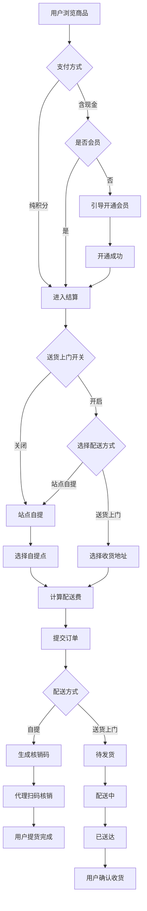
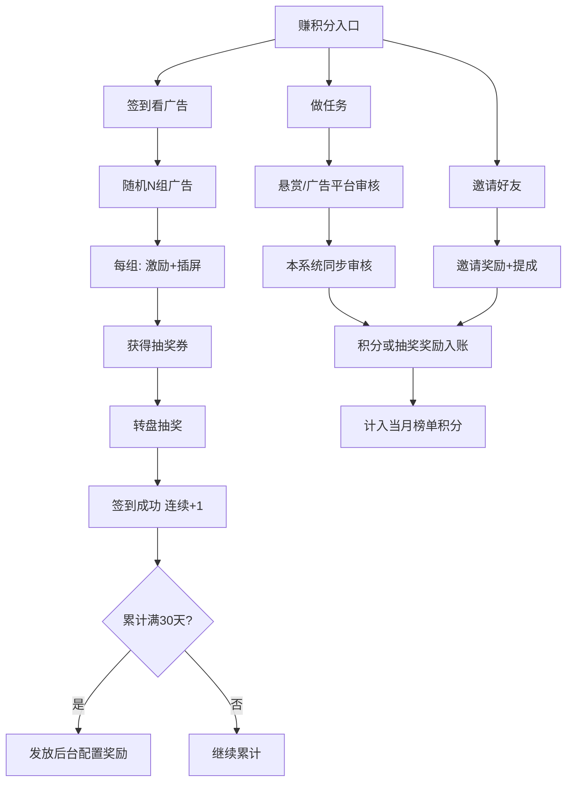
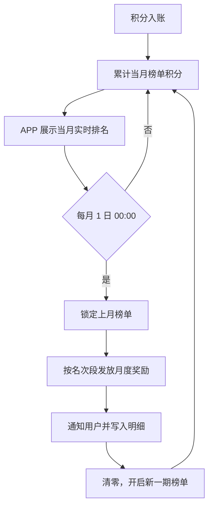

# TGG Shop 产品需求文档（PRD）

> **文档版本**：v1.5  
> **生成日期**：2026-06-22  
> **更新说明**：v1.2 基于《补充功能.doc》补充提现、签到看广告、下单配送时段、开屏广告等  
> **来源文档**：《产品设计第二版.pdf》《新建 DOC 文档 (3).doc》《补充功能.doc》  
> **文档说明**：本文档基于产品设计稿与业务规则说明整理，用于指导 APP 开发、后台管理及第三方对接。

---

## 1. 项目概述

### 1.1 产品定位

TGG Shop 是一款集 **商城购物**、**积分体系**、**自提配送**、**送货上门**、**代理核销**、**邀请分销** 于一体的移动端电商应用。用户可通过签到、做任务、邀请好友等方式获取积分，并使用积分或现金购买商品；商品支持 **自提点取货**（代理扫码核销）与 **送货上门** 两种方式，其中送货上门服务由后台统一开关控制，可随时开启或关闭。

### 1.2 设计参考

| 模块 | 参考产品 |
|------|----------|
| 商城分类、商品列表 | 朴朴、京东 |
| 用户中心、订单状态 | 淘宝 |
| 代理核销流程 | 抖音（核销码模式） |
| 退货退款 | 朴朴、美团 |

### 1.3 目标用户

- **普通用户**：购物、赚积分、自提取货或送货上门
- **会员用户**：享受会员价、积分兑换特权
- **代理用户**：负责线下扫码核销订单
- **平台运营**：后台配置规则、审核任务、管理代理与配送

---

## 2. 信息架构与导航

### 2.1 底部 Tab 导航（5 个）

| Tab | 名称 | 说明 |
|-----|------|------|
| 1 | 首页 | 搜索、轮播、快捷入口、热门商品 |
| 2 | 赚积分 | **做任务** / **签到** 双 Tab |
| 3 | 商城分类 | 商品分类浏览 |
| 4 | 购物车 | 购物车管理 |
| 5 | 我的 | 个人中心与功能入口 |

---

## 3. 功能需求

### 3.1 首页模块

#### 3.1.1 定位

- 展示用户当前定位信息
- 定位用于匹配附近自提站点及送货上门服务范围

#### 3.1.2 产品搜索栏

- 支持关键词搜索商品
- 搜索结果跳转商品列表/详情

#### 3.1.3 滚动屏（轮播 Banner）

- 3 个展位轮播
- 支持后台配置图片与跳转链接

#### 3.1.4 积分快捷入口（3 个）

| 入口 | 功能 |
|------|------|
| 签到拿积分 | 跳转签到页 |
| 做任务拿积分 | 跳转任务列表 |
| 邀请好友拿积分 | 跳转邀请码/分享页 |

#### 3.1.5 商城分类入口

- 首页展示主要分类入口
- UI 参考朴朴

#### 3.1.6 产品热门栏

- 展示热门/推荐商品
- 页面布局参考朴朴

#### 3.1.7 开屏广告

- 用户 **打开 APP** 时展示开屏广告（Splash Ad）
- 支持后台 **开启 / 关闭** 开屏广告
- 可配置：广告素材、展示时长（如 3–5 秒）、是否可跳过及跳过倒计时
- 开屏广告展示期间不阻塞必要初始化（定位、登录态等可在后台并行加载）

---

### 3.2 赚积分模块

赚积分 Tab 分为 **「做任务」** 与 **「签到」** 两个独立板块（顶部 Tab 切换）。

#### 3.2.1 做任务（对接悬赏平台 API）

> 接口文档：`api接口文档 (4).pdf` · 实现参考：`app/earn-points.html`

| 页面 | 接口 | 说明 |
|------|------|------|
| 任务分类 | `index/index/task_type` | 顶部分类 Tab |
| 任务列表 | `index/index/task_list` | 支持 search、c_id 筛选、分页 |
| 任务详情 | `index/index/task_info` | 展示步骤 content、奖励、option |
| 提交任务 | `index/index/task_register` | 会员接任务交单 |
| 上传截图 | `/api/common/upload` | option 含 imgea 时 |
| 我的提交 | `index/index/get_examine_list` | 按 status 筛选审核状态 |

**列表页展示规则**（符合 UI 规范）：
- 展示：任务名称、小图、分类、提醒 tishi
- **不展示** reward / users_ratio（用户点击「去完成」进入详情后才可见奖励）

**详情页展示**：
- 任务金额 reward、会员可得 users_ratio
- 步骤图文 content、注意事项 tishi
- 暂停任务 is_pause 不可接

**会员接任务流程**：
```
选分类 → 浏览列表 → 任务详情 → 接任务 → 按 option 填表/上传 → 提交
→ 我的提交（审核中/通过/失败）→ 平台回调 → TGG 同步发积分
```

**option 动态表单**：

| option | 字段 |
|--------|------|
| name | 姓名 |
| mobile | 手机号 |
| text1 / text2 | 备注 |
| imgea | 截图（多图 upload 后逗号拼接） |

**鉴权**：所有请求携带 appid + sign（MD5(Ymd+appid+key)）；提交/审核查询携带 sf_uid（TGG 用户 ID）。

#### 3.2.3 拉新任务（邀请好友）

> **不调用悬赏平台 API**，为 TGG 自有邀请分销逻辑，详见 §3.9；接口草案见 §4.5。

**入口位置**：做任务 Tab 顶部固定卡片「拉新任务 · 邀请好友」（与悬赏任务列表并列，位于分类 Tab 下方）。

**列表展示规则**（符合 UI-04）：
- 卡片仅展示任务名称与引导文案
- **不展示**「+3 积分」「10% 提成」等具体数值
- 用户点击「去完成 ›」进入 **我的邀请码** 页后，才展示奖励规则详情

**我的邀请码页**：
- 展示唯一邀请码、复制、分享（微信等）
- 展示奖励规则：邀请成功积分、任务提成比例、新用户 1 个月会员（数值后台可配置）
- 展示累计邀请人数、累计提成积分
- 展示邀请列表：被邀请人昵称、注册时间、贡献积分

**业务流程**：
```
分享邀请码 → 好友注册并绑定 → 邀请人 +N 积分
→ 被邀请人做任务获积分 → 邀请人获 M% 持续提成
→ 积分写入明细，可在邀请页查看贡献
```

**与悬赏任务的区别**：

| 维度 | 做任务（悬赏 API） | 拉新任务（TGG 自有） |
|------|-------------------|---------------------|
| 数据来源 | 悬赏平台 task_* 接口 | TGG 邀请/用户体系 |
| 奖励发放 | 平台审核回调 → TGG 发积分 | 注册绑定 + 任务提成，TGG 直接计算 |
| 列表展示 | 不展示 reward | 不展示具体积分/比例 |

#### 3.2.4 签到（看广告 + 抽奖）

- 与「做任务」板块 **独立**，不调用悬赏 task 接口
- 展示 **「签满 30 天送 XXX」**（后台配置），不使用「今日签到 +10 积分」
- 30 天连续签到奖励由后台配置，达标后自动发放

##### 3.2.4.1 广告组规则

**一组 = 1 激励视频（激）+ 1 插屏广告（插）**，必须按顺序看完才算完成该组。

| 概念 | 说明 |
|------|------|
| 广告组 | 1 激 + 1 插，成对出现 |
| 当日组数 | 后台配置 **随机范围**（如 min=3、max=5），系统每日为用户随机抽取 N 组 |
| 当日总广告数 | N 组 × 2 = 2N 条（N 组则 N 个激 + N 个插） |

**示例**：后台设置 3–5 组，今日随机到 **4 组** → 用户需看完 **4 激 + 4 插**，共 8 条广告。

**签到页展示**：
- 「今日任务：观看 **N 组** 广告」
- 说明「每组 = 1 激励视频 + 1 插屏广告」
- **不前置展示** 抽奖具体奖励数值（与 UI-04 一致）

##### 3.2.4.2 看广告流程

```
点击「立即签到」→ 跳转/唤起广告 SDK
→ 第1组：激励视频 → 插屏广告
→ 第2组：激励视频 → 插屏广告
→ … 直至第 N 组完成
→ 发放抽奖券 ×1 → 展示抽奖转盘
→ 用户点击抽奖 → 按后台权重随机出奖 → 积分/奖品入账
→ 计入连续签到天数 +1
```

- 用户点击「立即签到」时 **自动跳转广告页**（或唤起广告 SDK）
- 进度页展示：当前第几组、当前是激/插、已完成条数 / 总条数
- 中途退出可续看（服务端记录进度，当日有效）
- 全部看完后 **签到成功**，连续天数 +1

##### 3.2.4.3 抽奖转盘

| 项 | 说明 |
|----|------|
| 获得条件 | 当日 N 组广告全部看完 |
| 抽奖券 | 每日完成广告任务获得 **1 张**（后台可配置是否允许多次） |
| 转盘奖品 | 后台配置奖品列表（如 5/10/20/50/100 积分、「谢谢参与」等） |
| 出奖规则 | 按 **权重随机**，具体数值与概率均由后台配置 |
| 展示 | 转盘扇区展示奖品名称；**具体奖励金额不在签到首页前置展示** |

##### 3.2.4.4 后台可配置项

| 配置项 | 说明 | 示例 |
|--------|------|------|
| ad_group_min | 每日广告组数下限 | 3 |
| ad_group_max | 每日广告组数上限 | 5 |
| streak_days | 连续签到满 N 天奖励 | 30 |
| streak_reward | 满 N 天奖励内容 | 100 积分 / 实物 |
| lottery_prizes | 转盘奖品及权重 | 见 §4.6 |
| lottery_daily_limit | 每日抽奖次数上限 | 1 |

---

### 3.3 商城分类模块

- 完整商品分类树
- 分类页、商品列表页参考朴朴、京东
- 支持按分类浏览、筛选、进入商品详情

---

### 3.4 购物车模块

- 添加/删除/修改商品数量
- 结算前校验会员状态、积分余额、配送费
- 跳转订单确认页

---

### 3.5 商品详情与购买规则

#### 3.5.1 支付方式与会员关系

| 支付方式 | 会员要求 | 价格 |
|----------|----------|------|
| 纯积分兑换 | **不需要**开通会员 | 享受会员价 |
| 现金购买 | **必须**开通会员 | 会员价 |
| 积分 + 现金补差 | **必须**开通会员 | 积分不足部分用现金补足 |

> 规则说明：只要涉及现金支付（含积分不足补差价），均须先开通会员。

#### 3.5.2 购买限额

- 每个账号 **每天最多购买 500 元** 商品（金额上限可在后台配置）

#### 3.5.3 现金购买引导

- 非会员用户使用现金购买时，弹窗/页面提醒开通会员
- 提供跳转 **微信** 或 **支付宝** 开通会员入口
- 会员费用后台可配置

---

### 3.6 会员体系

#### 3.6.1 新用户赠送

- 每个新用户注册当天起，**赠送 1 个月会员**
- 1 个月到期后会员卡失效，需重新开通才能激活

#### 3.6.2 会员开通方式

- 现金开通（微信/支付宝）
- **积分开通**（积分不足可现金补差）

#### 3.6.3 月卡倒计时

- 开通月卡会员后，从开通时刻起进入 **30 天** 倒计时
- 会员到期页面/状态需明确展示剩余天数

#### 3.6.5 会员与非会员权益

- **会员与非会员权益基本保持不变**（以本文档 §3.5、§3.6 已定义规则为准）
- 核心差异仍为：
  - 现金购买（含补差）须为会员
  - 纯积分兑换无需会员，享会员价
  - 新用户赠送 1 个月会员体验

---

### 3.7 订单与配送

#### 3.7.1 配送方式总开关

系统预置 **站点自提** 与 **送货上门** 两种配送能力，均由后台独立开关控制：

| 开关 | 默认 | 说明 |
|------|------|------|
| **站点自提开关** | 开启 | 关闭后 APP 不展示自提相关选项 |
| **送货上门服务开关** | 关闭 | 开启后 APP 展示送货上门选项 |

- 至少一种配送方式开启时，用户方可完成下单；两者均关闭时，需提示「暂不支持下单」
- 开关状态实时生效，APP 根据配置动态展示配送方式

#### 3.7.2 配送方式选择

用户在 **订单确认页** 选择配送方式（取决于后台开关）：

| 配送方式 | 说明 | 可见条件 |
|----------|------|----------|
| **站点自提** | 到自提点凭核销码取货 | 自提开关开启 |
| **送货上门** | 配送至用户指定地址 | 送货上门开关开启 |

- 仅一种方式开启时，默认选中该方式，可不展示切换 Tab
- 两种方式均开启时，用户可自由选择
- 同一订单仅可选择一种配送方式，下单后不可更改

#### 3.7.3 站点自提（淘宝模式）

- 用户可 **填写/管理自己的联系地址**（姓名、手机号、地址信息），用于订单联系与展示
- **提货仍须到自提点** 凭核销码取货（淘宝模式：有地址信息，但履约方式为到站自提）
- 自提点 **详细地址由后台配置**，与用户端看到的自提点地址 **实时同步**
- 用户从系统预设 **自提站点列表** 中选择取货站点，不可将任意自定义门牌地址作为自提点
- 根据定位推荐自提站点，例如：定位到「师大」→ 推荐「师大站点」
- 下单后通过消息/订单页告知用户到哪个自提点取货
- **自提点仅承担核销功能**（代理扫码核销），不承担其他线下业务

**代理核销流程（仅自提订单）：**

```
用户下单 → 生成核销码 → 用户到自提点 → 代理扫码核销 → 用户提货
```

| 角色 | 行为 |
|------|------|
| 普通用户 | 每下一单生成一个核销码（类似抖音核销码） |
| 代理用户 | 进入「扫一扫」扫描用户核销码，核销完成后用户提货 |
| 非代理用户 | 打开代理功能时提示「您不是代理」 |

- 后台可设置哪些账号为代理
- 用户申请代理时，**跳转客服** 进行沟通与审批（见 §3.8.4）

#### 3.7.4 送货上门

**功能预置，由后台开关控制是否对用户可见。**

##### 收货地址管理

- 用户可 **新增 / 编辑 / 删除** 收货地址
- 地址字段：收货人姓名、手机号、省市区、详细地址（门牌号）、可选地图选点定位
- 支持设置默认收货地址
- 结算时从地址列表选择，或新增地址
- 地址需在 **送货上门服务范围** 内，否则不可下单

##### 下单与配送

- 用户选择「送货上门」并确认收货地址
- 结算页展示预计送达时间（后台可配置是否展示、文案规则）
- 默认提示示例：**「预计明天 14:00–18:00 送达」**（具体时间规则后台可配）
- **不生成自提核销码**，不走代理扫码核销流程
- 配送完成后，用户确认收货或系统自动确认（超时天数后台可配）

##### 送货上门订单状态

| 状态 | 说明 |
|------|------|
| 待发货 | 已支付，等待备货/出库 |
| 配送中 | 已发出，正在配送 |
| 已送达 | 配送完成，待用户确认或已自动确认 |
| 已收货 | 用户确认收货或超时自动确认 |

##### 消息通知

- 订单已发出 / 配送中 / 已送达 推送通知
- 可选：预计送达时间段提醒

#### 3.7.5 配送费规则

- 用户下单结算时，根据 **配送方式** 自动计算配送费
- **站点自提** 默认规则：
  - 100 元以内：**3 元**
  - 101–200 元：**6 元**
  - 200 元以上：后台配置（见待确认事项）
- **送货上门** 默认规则：
  - 可与自提共用同一套档位规则，也可在后台 **单独配置** 送货上门配送费
- 后台可配置：
  - 是否启用配送费
  - 自提 / 送货上门各自是否收费
  - 各金额档位对应配送费
  - 满额免配送费门槛（可选）

#### 3.7.7 下单配送时段规则

用户 **提交订单时** 弹出 **配送时间说明**，明确当日配送或隔日配送规则。

##### 截单时间（后台可配置）

- 默认 **每日凌晨 05:00** 为截单分界点（可配置为其他时刻）
- 规则示例（假设截单点为 05:00）：

| 下单时间 | 预计配送日 |
|----------|------------|
| 11 日 05:00 ~ 12 日 05:00 前 | **12 日** 配送 |
| 12 日 05:00 ~ 13 日 05:00 前 | **13 日** 配送 |
| 13 日 05:00 ~ 14 日 05:00 前 | **14 日** 配送 |

##### 展示示例

- 13 日 **03:00** 下单 → 提示 **「13 号配送」**
- 13 日 **10:00** 下单 → 提示 **「14 号配送」**（已过当日截单点）

- 结算页/下单确认弹窗需 **醒目展示** 预计配送日期
- 自提与送货上门订单 **共用同一套截单规则**（除非后台为两种方式分别配置）
- 截单时间点、文案模板均可后台配置

#### 3.7.8 订单状态与展示（统一）

- 订单列表参考淘宝：**待收货**、**已收货**
- 订单卡片/详情需展示 **配送方式标签**（站点自提 / 送货上门）
- **自提订单**：展示自提点详细地址、核销码（待核销时）
- **送货上门订单**：展示收货地址、配送进度、预计/实际送达时间
- 可选功能（后台可启用/隐藏）：展示预计配送日期（见 §3.7.7）

---

### 3.8 我的（个人中心）

#### 3.8.1 用户信息区

展示字段（参考淘宝）：

- 头像
- 名称
- 等级
- 积分
- 提现（见 §3.8.2）
- 开通会员

#### 3.8.2 提现

- 用户可将可提现余额 **提现至微信**
- **最低提现金额：1 元起**（后台可配置）
- **手续费：1%**（后台可配置比例）
- 实际到账 = 提现金额 − 手续费
- 提现记录可在明细中查看
- 后台可配置：最低金额、手续费比例、每日提现次数/上限、审核方式（自动/人工）

#### 3.8.3 我的订单

- 待收货 / 已收货
- 展示 **配送方式**（站点自提 / 送货上门）
- **自提订单**：展示自提点详细地址、核销码入口
- **送货上门订单**：展示收货地址、配送进度
- 可选：显示预计送达/到站时间

#### 3.8.4 功能菜单

| 序号 | 功能 | 说明 |
|------|------|------|
| 1 | 我的邀请码 | 含分销机制，见 3.9 |
| 2 | 积分明细 | 积分收支流水 |
| 3 | 收货地址 | 用户联系地址管理；自提点选择（见 §3.7.3）；送货上门地址（见 §3.7.4） |
| 4 | 我的收藏 | 收藏的商品 |
| 5 | 意见反馈 | 用户反馈入口 |
| 6 | 商务合作 | 可留联系方式并说明合作类型 |
| 7 | 申请点位代理 | **跳转客服**，由客服沟通并协助完成代理申请 |
| 8 | 积分排行榜 | 见 3.10 |
| 9 | 客服 | 联系客服 |

---

### 3.9 邀请分销机制

#### 3.9.1 邀请关系

- 每个用户拥有唯一邀请码
- 通过邀请码注册的用户与邀请人建立绑定关系

#### 3.9.2 邀请奖励（默认值，均可后台配置）

| 奖励类型 | 默认规则 | 后台参数 |
|----------|----------|----------|
| 邀请成功奖励 | 邀请人获得 **3 积分** | 可配置积分数量 |
| 持续提成 | 被邀请人做任务所得积分的 **10%** 奖励给邀请人 | 可配置提成比例 |

#### 3.9.3 我的邀请码页

- 展示邀请码与分享能力
- 展示：我邀请了谁、被邀请人积分贡献等
- 具体数值后台可配置

---

### 3.10 积分排行榜

- 按用户 **当月累计获得积分** 进行排名（仅统计本自然月内入账的积分，不含消费扣减）
- **每月 1 日 00:00** 自动执行 **榜单结算**：对 **上一自然月** 排行榜进行定榜、发放奖励，随后 **清零重新计算**，开启新一期月度榜单
- 即：**一个自然月为一期，每期奖励发放一次**
- 入口：我的 → 积分排行榜

#### 3.10.1 榜单周期规则

| 阶段 | 时间 | 说明 |
|------|------|------|
| 当期进行中 | 每月 1 日 00:00 结算后 ~ 当月末 | 用户赚积分实时累计，APP 展示 **当月实时排名** |
| 月度结算 | 每月 1 日 00:00 | 锁定上月榜单 → 发放奖励 → 当月积分计数归零，重新开始 |

- 例：3 月 1 日 00:00 结算 **2 月** 榜单并发放奖励，同时 3 月新一期榜单从 0 开始累计
- APP 需展示：**当前榜单期数**（如「2026 年 3 月榜」）、**距离下次结算**（如「还剩 12 天定榜」）

#### 3.10.2 月度奖励

- 根据 **上月最终排名** 发放奖励（积分、优惠券、实物等，具体规则 **后台可配置**）
- 支持配置：各名次段奖励内容（如第 1 名、第 2–10 名、第 11–50 名等）
- 奖励发放后写入积分明细/消息通知，用户可在排行榜页查看 **历史期数榜单** 及 **本人获奖记录**
- 若用户排名并列，按平台规则处理（后台可配置：并列同奖 / 按先到先得等）

#### 3.10.3 展示与刷新

- **当月排名**：积分变动后更新用户名次；APP 可定时刷新展示（刷新间隔 **后台可配置**，默认 5 分钟，仅影响页面展示，不影响月度结算周期）
- 展示 **最近一次榜单更新时间**
- 展示 **上月定榜结果**（结算完成后可查看）
- 每月 1 日结算期间，可展示「榜单结算中，请稍候」状态（结算任务应在合理时间内完成，如 30 分钟内）

#### 3.10.4 后台管理

- 开启/关闭积分排行榜功能
- 配置 **月度奖励规则**（名次段、奖励类型与数量）
- 配置 **榜单展示刷新间隔**（默认 5 分钟，仅影响 APP 展示频率）
- 查看/导出每期历史榜单
- 支持 **手动触发补结算**（异常情况下对指定期数重新定榜发奖，需操作日志）

---

### 3.11 退货退款

- 参考朴朴、美团退货流程
- 支持 **全额退款** 与 **部分退款**
- 退还的积分 **原路返还** 至用户账户
- **自提订单**：未核销前可退；已核销后按平台规则处理（见待确认事项）
- **送货上门订单**：未发货可全额退；配送中/已送达按签收状态及平台规则处理

---

## 4. 后台管理需求

### 4.1 可配置项汇总

| 配置项 | 说明 |
|--------|------|
| **站点自提开关** | 开启 / 关闭，控制 APP 是否展示自提选项 |
| **送货上门服务开关** | 开启 / 关闭，控制 APP 是否展示送货上门选项 |
| **自提点地址** | 后台维护详细地址，与用户端展示实时同步 |
| **下单截单时间** | 每日截单分界点（默认 05:00），决定当日/隔日配送 |
| **配送日期提示文案** | 下单时弹窗/结算页展示模板 |
| **开屏广告** | 开关、素材、时长、是否可跳过 |
| **签到看广告** | 广告组随机范围（min–max）、30 天签到奖励、转盘奖品与权重 |
| **签到抽奖** | 转盘奖品列表、各奖品权重、每日抽奖次数 |
| **提现规则** | 最低 1 元起、手续费 1%（均可配置）、提现至微信 |
| **送货服务范围** | 配送区域、半径或站点覆盖范围 |
| **送货上门配送费** | 是否收费、档位金额、是否可与自提分开配置 |
| **预计送达时间规则** | 送货上门预计时段文案与计算规则 |
| **自动确认收货天数** | 送货上门订单送达后 N 天自动确认 |
| 轮播 Banner | 3 个展位内容与链接 |
| 商品与分类 | 商品、价格、库存、分类 |
| 每日购买上限 | 默认 500 元/账号/天 |
| 会员价格 | 月卡费用 |
| 自提配送费规则 | 是否启用、各档位金额 |
| 代理账号 | 指定哪些用户为代理 |
| 邀请奖励 | 邀请积分、提成比例 |
| 自提配送提示 | 是否显示「次日配送时间+自提点」 |
| 商务合作 | 接收合作申请 |
| 任务/广告积分 | 任务数量（3–8 条随机）、奖励金额 |
| 积分排行榜 | 月度榜单开关、每月 1 日自动结算、名次段奖励规则、展示刷新间隔（默认 5 分钟） |

### 4.2 订单管理

- 订单列表、状态流转
- 按 **配送方式** 筛选：站点自提 / 送货上门
- **自提订单**：核销状态（待核销/已核销）、自提点信息
- **送货上门订单**：发货、配送中、已送达状态；收货地址；配送员/物流信息（如有）
- 支持后台手动更新配送状态（送货上门）

### 4.3 用户管理

- 用户列表、会员状态
- 代理资格审批
- 积分调整与流水查询

### 4.4 审核对接

- 与悬赏任务平台对接：对方审核通过后，本系统同步通过并发放积分
- 发放被邀请人任务积分时，同步计算邀请人 **M% 提成**（默认 10%，后台可配置）

### 4.5 TGG 邀请 API（草案）

> 实现参考：`app/js/invite-api.js`、`app/earn-points.html`（我的邀请码页）  
> 与悬赏平台 API **独立**，由 TGG 后端提供。

**基础约定**：

| 项 | 说明 |
|----|------|
| 协议 | HTTP POST |
| 编码 | UTF-8 |
| 鉴权 | 登录态 token + uid（与 APP 用户体系一致） |
| 响应 | `{ code: 0, msg, data }`，code=0 成功 |

#### 4.5.1 邀请信息 `POST /api/invite/info`

**请求**：`uid`, `token`

**响应 data**：

| 字段 | 类型 | 说明 |
|------|------|------|
| invite_code | string | 用户唯一邀请码 |
| share_url | string | 带邀请码的分享链接 |
| share_title | string | 分享文案标题 |
| reward_invite | number | 邀请成功奖励积分（默认 3） |
| reward_ratio | number | 任务提成比例 %（默认 10） |
| total_invited | number | 累计邀请人数 |
| total_commission | number | 累计提成积分 |

#### 4.5.2 邀请列表 `POST /api/invite/list`

**请求**：`uid`, `token`, `page`, `count`

**响应 data**：数组

| 字段 | 说明 |
|------|------|
| uid | 被邀请人用户 ID |
| nickname | 昵称 |
| avatar | 头像 URL |
| bind_time | 绑定/注册时间 |
| contributed | 累计贡献积分（提成来源） |

#### 4.5.3 邀请统计 `POST /api/invite/stats`（可选）

**响应 data**：`month_invited`, `month_commission`, `lifetime_invited`, `lifetime_commission`

#### 4.5.4 注册绑定（服务端）

- 用户注册时可选填 **invite_code**
- 校验邀请码有效且不可自邀、不可重复绑定
- 绑定成功后：被邀请人赠送 1 个月会员；邀请人获得 **reward_invite** 积分
- 被邀请人通过悬赏任务获得积分并入账时，按 **reward_ratio** 给邀请人发提成
- 所有变动写入积分流水，类型区分「邀请奖励」「邀请提成」

### 4.6 TGG 签到 API（草案）

> 实现参考：`app/js/signin-api.js`、`app/earn-points.html`（签到 Tab）  
> 对接广告 SDK 时，`ad_complete` 由客户端在广告回调成功后上报。

#### 4.6.1 签到状态 `POST /api/signin/status`

**响应 data**：

| 字段 | 说明 |
|------|------|
| group_count | 今日已确定的广告组数 N |
| group_min / group_max | 后台配置随机范围 |
| streak_days | 当前连续签到天数 |
| streak_reward_text | 展示文案，如「签满 30 天送 100 积分」 |
| signed_today | 今日是否已完成广告任务 |
| lottery_available | 是否有未使用的抽奖券 |
| prizes | 转盘奖品列表（label、weight） |

#### 4.6.2 开始签到 `POST /api/signin/start`

- 若当日尚未生成组数，服务端在 `[group_min, group_max]` 内随机 N
- 返回 `group_count`、`current_group=1`、`current_step=ji`

#### 4.6.3 广告完成上报 `POST /api/signin/ad_complete`

**请求**：`group_index`, `ad_type`（`ji` 激励 / `cha` 插屏）

**逻辑**：
- 同一组内必须先 `ji` 后 `cha`
- 全部 N 组完成后：`signed_today=true`，`lottery_ticket=1`，`streak_days+1`
- 返回下一组/下一步或 `finished=true`

#### 4.6.4 抽奖 `POST /api/signin/lottery_spin`

- 消耗当日抽奖券，按 `lottery_prizes` 权重随机
- 返回 `prize_id`、`prize_label`、`prize_value`，并写入积分流水

#### 4.6.5 转盘奖品配置（后台）

```json
[
  { "id": 1, "label": "5 积分", "value": 5, "weight": 30 },
  { "id": 2, "label": "10 积分", "value": 10, "weight": 25 },
  { "id": 6, "label": "谢谢参与", "value": 0, "weight": 2 }
]
```

---

## 5. 非功能需求

### 5.1 性能

- 当月榜单展示刷新延迟不超过后台配置的展示刷新间隔
- 每月 1 日榜单结算任务需稳定执行，避免重复发奖或漏发
- 首页、分类页加载流畅，参考主流电商体验

### 5.2 支付

- 支持微信支付、支付宝支付（会员开通、商品现金支付）

### 5.3 消息通知

- **自提订单**：自提点取货提醒、核销成功通知
- **送货上门订单**：已发货、配送中、已送达通知
- 可选：次日配送/送达时间通知
- 订单状态变更通知

### 5.4 安全

- 核销码一次性或时效性校验，防止重复核销
- 代理权限严格校验
- 支付与积分变动需有完整日志

---

## 6. 页面清单（开发用）

| 页面 | 优先级 | 备注 |
|------|--------|------|
| 首页 | P0 | 含搜索、轮播、快捷入口、热门商品 |
| 开屏广告 | P1 | 打开 APP 展示，后台可关闭 |
| 赚积分-做任务 | P0 | 对接 task_type/list/info/register/examine API；含拉新入口卡片 |
| 赚积分-拉新 | P0 | 我的邀请码页，对接 TGG invite API（§4.5） |
| 赚积分-签到 | P0 | 看广告签到（激+插成组）+ 抽奖转盘 |
| 商城分类 | P0 | 参考朴朴 |
| 商品详情 | P0 | |
| 购物车 | P0 | |
| 订单确认/结算 | P0 | 含配送方式、截单配送日提示、配送费、会员校验 |
| 我的 | P0 | |
| 我的订单 | P0 | 区分自提/送货上门展示 |
| 我的邀请码 | P0 | 赚积分-做任务内入口；含分享、邀请列表、奖励规则 |
| 积分明细 | P1 | |
| 自提点选择 | P0 | 从预设站点列表选择 |
| 收货地址管理 | P0 | 送货上门地址增删改；开关关闭时入口可隐藏或仅管理 |
| 积分排行榜 | P1 | 月度周期，每月 1 日结算发奖并重置 |
| 代理扫一扫核销 | P1 | 仅代理可见 |
| 申请点位代理 | P2 | 跳转客服 |
| 提现 | P1 | 最低 1 元，手续费 1%，提到微信 |
| 商务合作 | P2 | |
| 意见反馈 | P2 | |
| 客服 | P1 | |
| 会员开通 | P0 | 微信/支付宝/积分 |
| 退货申请 | P1 | 参考朴朴/美团 |

---

## 7. 业务流程图

### 7.1 下单与履约



### 7.2 积分获取



### 7.3 积分排行榜月度结算



---

## 8. 待确认事项（Open Questions）

1. 会员到期后，已有积分是否可继续用于纯积分兑换？
2. 用户等级体系的具体规则（升级条件、权益）未详细定义。
3. 自提点数据结构与站点管理后台需单独设计。
4. 与悬赏任务平台 / 广告后台的 API 对接规范需技术方案确认。
5. 送货上门与自提的配送费是否共用规则，还是完全独立配置？
6. 订单金额 **200 元以上** 的自提/送货上门配送费档位。
7. 送货上门是否对接第三方物流，还是平台自建配送？
8. 自提订单已核销、送货上门已签收后，是否允许退货及规则边界。
9. 提现资金来源（积分兑换、分销佣金等）及可提现余额计算规则。
10. 开屏广告与签到广告是否共用同一广告 SDK/后台。

---

## 9. UI/UX 设计要求

| 编号 | 要求 | 说明 |
|------|------|------|
| UI-01 | 布局间距 | 各模块/卡片间距适当拉开，层次分明，避免元素挤在一起 |
| UI-02 | 自提点地址 | 后台配置详细地址，与用户端展示完全一致、实时同步 |
| UI-04 | 赚积分页 | 任务不前置展示积分；签到展示「签满30天送XXX」；抽奖奖励进转盘后可见 |

---

## 10. 版本记录

| 版本 | 日期 | 说明 |
|------|------|------|
| v1.5 | 2026-06-23 | 签到：激+插成组、随机组数、抽奖券+转盘；§4.6 签到 API |
| v1.4 | 2026-06-23 | 拉新任务入口与我的邀请码页；§3.2.4 与 TGG 邀请 API 草案 |
| v1.3 | 2026-06-23 | 对接悬赏 API；赚积分拆分为做任务/签到双板块 |
| v1.2 | 2026-06-22 | 基于《补充功能.doc》：提现、签到看广告、配送时段等 |
| v1.1 | 2026-06-22 | 新增送货上门服务；积分排行榜改为月度周期 |
| v1.0 | 2026-06-22 | 基于《产品设计第二版.pdf》与《新建 DOC 文档 (3).doc》首次整理 |
