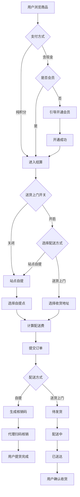
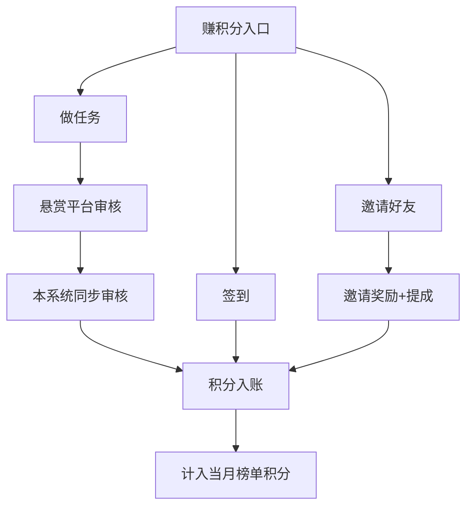
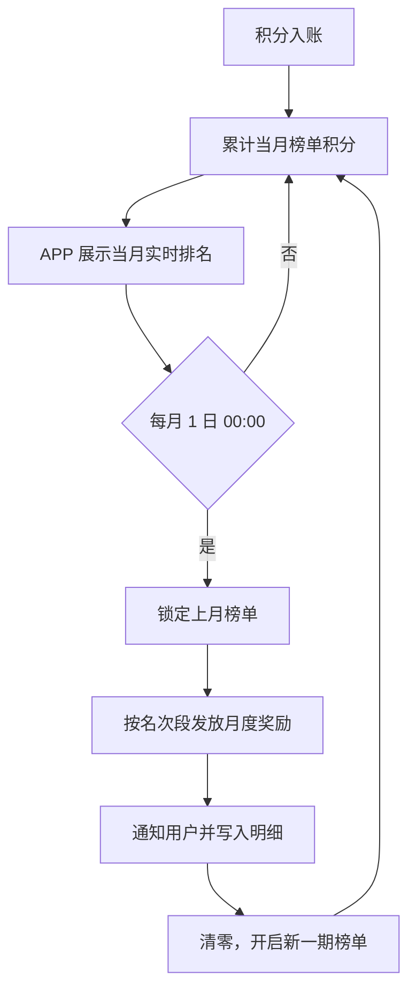

# TGG Shop 产品需求文档（PRD）

> **文档版本**：v1.1  
> **生成日期**：2026-06-22  
> **更新说明**：v1.1 新增「送货上门服务」，支持后台开关控制  
> **来源文档**：《产品设计第二版.pdf》《新建 DOC 文档 (3).doc》  
> **文档说明**：本文档基于产品设计稿与业务规则说明整理，用于指导 APP 开发、后台管理及第三方对接。

---

## 1. 项目概述

### 1.1 产品定位

TGG Shop 是一款集 **商城购物**、**积分体系**、**自提配送**、**送货上门**、**代理核销**、**邀请分销** 于一体的移动端电商应用。用户可通过签到、做任务、邀请好友等方式获取积分，并使用积分或现金购买商品；商品支持 **自提点取货**（代理扫码核销）与 **送货上门** 两种方式，其中送货上门服务由后台统一开关控制，可随时开启或关闭。

### 1.2 设计参考

| 模块 | 参考产品 |
|------|----------|
| 商城分类、商品列表 | 朴朴、京东 |
| 用户中心、订单状态 | 淘宝 |
| 代理核销流程 | 抖音（核销码模式） |
| 退货退款 | 朴朴、美团 |

### 1.3 目标用户

- **普通用户**：购物、赚积分、自提取货或送货上门
- **会员用户**：享受会员价、积分兑换特权
- **代理用户**：负责线下扫码核销订单
- **平台运营**：后台配置规则、审核任务、管理代理与配送

---

## 2. 信息架构与导航

### 2.1 底部 Tab 导航（5 个）

| Tab | 名称 | 说明 |
|-----|------|------|
| 1 | 首页 | 搜索、轮播、快捷入口、热门商品 |
| 2 | 赚积分 | 做任务、签到等积分获取入口 |
| 3 | 商城分类 | 商品分类浏览 |
| 4 | 购物车 | 购物车管理 |
| 5 | 我的 | 个人中心与功能入口 |

---

## 3. 功能需求

### 3.1 首页模块

#### 3.1.1 定位

- 展示用户当前定位信息
- 定位用于匹配附近自提站点及送货上门服务范围

#### 3.1.2 产品搜索栏

- 支持关键词搜索商品
- 搜索结果跳转商品列表/详情

#### 3.1.3 滚动屏（轮播 Banner）

- 3 个展位轮播
- 支持后台配置图片与跳转链接

#### 3.1.4 积分快捷入口（3 个）

| 入口 | 功能 |
|------|------|
| 签到拿积分 | 跳转签到页 |
| 做任务拿积分 | 跳转任务列表 |
| 邀请好友拿积分 | 跳转邀请码/分享页 |

#### 3.1.5 商城分类入口

- 首页展示主要分类入口
- UI 参考朴朴

#### 3.1.6 产品热门栏

- 展示热门/推荐商品
- 页面布局参考朴朴

---

### 3.2 赚积分模块

#### 3.2.1 做任务

- 展示可完成的悬赏/广告任务列表
- 任务完成后经平台审核，积分同步发放至用户账户
- 任务规则：随机 3–8 条任务，奖励规则按平台约定执行
- 悬赏任务平台审核通过后，本系统同步审核通过并发放积分

#### 3.2.2 签到

- 用户每日签到获得积分
- 签到记录可在积分明细中查看

---

### 3.3 商城分类模块

- 完整商品分类树
- 分类页、商品列表页参考朴朴、京东
- 支持按分类浏览、筛选、进入商品详情

---

### 3.4 购物车模块

- 添加/删除/修改商品数量
- 结算前校验会员状态、积分余额、配送费
- 跳转订单确认页

---

### 3.5 商品详情与购买规则

#### 3.5.1 支付方式与会员关系

| 支付方式 | 会员要求 | 价格 |
|----------|----------|------|
| 纯积分兑换 | **不需要**开通会员 | 享受会员价 |
| 现金购买 | **必须**开通会员 | 会员价 |
| 积分 + 现金补差 | **必须**开通会员 | 积分不足部分用现金补足 |

> 规则说明：只要涉及现金支付（含积分不足补差价），均须先开通会员。

#### 3.5.2 购买限额

- 每个账号 **每天最多购买 500 元** 商品（金额上限可在后台配置）

#### 3.5.3 现金购买引导

- 非会员用户使用现金购买时，弹窗/页面提醒开通会员
- 提供跳转 **微信** 或 **支付宝** 开通会员入口
- 会员费用后台可配置

---

### 3.6 会员体系

#### 3.6.1 新用户赠送

- 每个新用户注册当天起，**赠送 1 个月会员**
- 1 个月到期后会员卡失效，需重新开通才能激活

#### 3.6.2 会员开通方式

- 现金开通（微信/支付宝）
- **积分开通**（积分不足可现金补差）

#### 3.6.3 月卡倒计时

- 开通月卡会员后，从开通时刻起进入 **30 天** 倒计时
- 会员到期页面/状态需明确展示剩余天数

#### 3.6.4 会员失效后积分处理

- 会员到期后，已获得的积分按到期前累计数量保留
- 过期后积分使用规则按平台政策执行（需与运营确认细则）

---

### 3.7 订单与配送

#### 3.7.1 送货上门服务总开关

- 后台提供 **「送货上门服务」** 全局开关，支持随时 **开启 / 关闭**
- **默认状态：关闭**（仅展示自提模式；功能预置完成，运营按需开启）
- 开关状态实时生效，APP 端根据配置动态展示配送方式选项

| 开关状态 | APP 表现 |
|----------|----------|
| **关闭** | 仅支持 **站点自提**，不展示「送货上门」选项 |
| **开启** | 结算页展示 **站点自提 / 送货上门** 两种方式，用户可自由选择 |

- 后台可配置 **送货上门服务范围**（按区域/半径/站点覆盖范围，与定位联动）
- 超出服务范围的地址，提示「当前地址不在配送范围内，请选择自提或更换地址」

#### 3.7.2 配送方式选择

用户在 **订单确认页** 选择配送方式（送货上门开关开启时）：

| 配送方式 | 说明 | 适用场景 |
|----------|------|----------|
| **站点自提** | 选择自提站点，到站后凭核销码取货 | 默认方式，开关关闭时唯一方式 |
| **送货上门** | 填写收货地址，由平台配送至用户指定地址 | 仅开关开启时可选 |

- 同一订单仅可选择一种配送方式，下单后不可更改
- 商品详情页、购物车可展示当前是否支持送货上门（只读提示，最终以结算页为准）

#### 3.7.3 站点自提（原有模式）

- **不支持**用户手动输入任意自提地址（类似快递站模式）
- 根据定位推荐自提站点，例如：定位到「师大」→ 可选「师大站点」自提
- 用户可从系统预设 **自提站点列表** 中选择，不可自定义门牌地址作为自提点
- 下单后通过消息/订单页告知用户到哪个自提点取货
- 可选功能（后台可启用/隐藏）：提示 **「第二天几点配送到哪个自提点」**

**代理核销流程（仅自提订单）：**

```
用户下单 → 生成核销码 → 用户到自提点 → 代理扫码核销 → 用户提货
```

| 角色 | 行为 |
|------|------|
| 普通用户 | 每下一单生成一个核销码（类似抖音核销码） |
| 代理用户 | 进入「扫一扫」扫描用户核销码，核销完成后用户提货 |
| 非代理用户 | 打开代理功能时提示「您不是代理」 |

- 后台可设置哪些账号为代理
- APP 内提供「申请点位代理」入口

#### 3.7.4 送货上门（新增）

**功能预置，由后台开关控制是否对用户可见。**

##### 收货地址管理

- 用户可 **新增 / 编辑 / 删除** 收货地址
- 地址字段：收货人姓名、手机号、省市区、详细地址（门牌号）、可选地图选点定位
- 支持设置默认收货地址
- 结算时从地址列表选择，或新增地址
- 地址需在 **送货上门服务范围** 内，否则不可下单

##### 下单与配送

- 用户选择「送货上门」并确认收货地址
- 结算页展示预计送达时间（后台可配置是否展示、文案规则）
- 默认提示示例：**「预计明天 14:00–18:00 送达」**（具体时间规则后台可配）
- **不生成自提核销码**，不走代理扫码核销流程
- 配送完成后，用户确认收货或系统自动确认（超时天数后台可配）

##### 送货上门订单状态

| 状态 | 说明 |
|------|------|
| 待发货 | 已支付，等待备货/出库 |
| 配送中 | 已发出，正在配送 |
| 已送达 | 配送完成，待用户确认或已自动确认 |
| 已收货 | 用户确认收货或超时自动确认 |

##### 消息通知

- 订单已发出 / 配送中 / 已送达 推送通知
- 可选：预计送达时间段提醒

#### 3.7.5 配送费规则

- 用户下单结算时，根据 **配送方式** 自动计算配送费
- **站点自提** 默认规则：
  - 100 元以内：**3 元**
  - 101–200 元：**6 元**
  - 200 元以上：后台配置（见待确认事项）
- **送货上门** 默认规则：
  - 可与自提共用同一套档位规则，也可在后台 **单独配置** 送货上门配送费
- 后台可配置：
  - 是否启用配送费
  - 自提 / 送货上门各自是否收费
  - 各金额档位对应配送费
  - 满额免配送费门槛（可选）

#### 3.7.6 订单状态与展示（统一）

- 订单列表参考淘宝：**待收货**、**已收货**
- 订单卡片/详情需展示 **配送方式标签**（站点自提 / 送货上门）
- **自提订单**：展示自提点详细地址、核销码（待核销时）
- **送货上门订单**：展示收货地址、配送进度、预计/实际送达时间
- 可选功能（后台可启用/隐藏）：自提订单提示「第二天几点到哪个自提点」

---

### 3.8 我的（个人中心）

#### 3.8.1 用户信息区

展示字段（参考淘宝）：

- 头像
- 名称
- 等级
- 积分
- 提现
- 开通会员

#### 3.8.2 我的订单

- 待收货 / 已收货
- 展示 **配送方式**（站点自提 / 送货上门）
- **自提订单**：展示自提点详细地址、核销码入口
- **送货上门订单**：展示收货地址、配送进度
- 可选：显示预计送达/到站时间

#### 3.8.3 功能菜单

| 序号 | 功能 | 说明 |
|------|------|------|
| 1 | 我的邀请码 | 含分销机制，见 3.9 |
| 2 | 积分明细 | 积分收支流水 |
| 3 | 收货地址 | 自提站点选择（见 3.7.3）；送货上门地址管理（见 3.7.4，开关开启时可用） |
| 4 | 我的收藏 | 收藏的商品 |
| 5 | 意见反馈 | 用户反馈入口 |
| 6 | 商务合作 | 可留联系方式并说明合作类型 |
| 7 | 申请点位代理 | 提交代理申请 |
| 8 | 积分排行榜 | 见 3.10 |
| 9 | 客服 | 联系客服 |

---

### 3.9 邀请分销机制

#### 3.9.1 邀请关系

- 每个用户拥有唯一邀请码
- 通过邀请码注册的用户与邀请人建立绑定关系

#### 3.9.2 邀请奖励（默认值，均可后台配置）

| 奖励类型 | 默认规则 |
|----------|----------|
| 邀请成功奖励 | 邀请人获得 **3 积分** |
| 持续提成 | 被邀请人做任务所得积分的 **10%** 奖励给邀请人 |

#### 3.9.3 我的邀请码页

- 展示邀请码与分享能力
- 展示：我邀请了谁、被邀请人积分贡献等
- 具体数值后台可配置

---

### 3.10 积分排行榜

- 按用户 **当月累计获得积分** 进行排名（仅统计本自然月内入账的积分，不含消费扣减）
- **每月 1 日 00:00** 自动执行 **榜单结算**：对 **上一自然月** 排行榜进行定榜、发放奖励，随后 **清零重新计算**，开启新一期月度榜单
- 即：**一个自然月为一期，每期奖励发放一次**
- 入口：我的 → 积分排行榜

#### 3.10.1 榜单周期规则

| 阶段 | 时间 | 说明 |
|------|------|------|
| 当期进行中 | 每月 1 日 00:00 结算后 ~ 当月末 | 用户赚积分实时累计，APP 展示 **当月实时排名** |
| 月度结算 | 每月 1 日 00:00 | 锁定上月榜单 → 发放奖励 → 当月积分计数归零，重新开始 |

- 例：3 月 1 日 00:00 结算 **2 月** 榜单并发放奖励，同时 3 月新一期榜单从 0 开始累计
- APP 需展示：**当前榜单期数**（如「2026 年 3 月榜」）、**距离下次结算**（如「还剩 12 天定榜」）

#### 3.10.2 月度奖励

- 根据 **上月最终排名** 发放奖励（积分、优惠券、实物等，具体规则 **后台可配置**）
- 支持配置：各名次段奖励内容（如第 1 名、第 2–10 名、第 11–50 名等）
- 奖励发放后写入积分明细/消息通知，用户可在排行榜页查看 **历史期数榜单** 及 **本人获奖记录**
- 若用户排名并列，按平台规则处理（后台可配置：并列同奖 / 按先到先得等）

#### 3.10.3 展示与刷新

- **当月排名**：积分变动后更新用户名次；APP 可定时刷新展示（刷新间隔 **后台可配置**，默认 5 分钟，仅影响页面展示，不影响月度结算周期）
- 展示 **最近一次榜单更新时间**
- 展示 **上月定榜结果**（结算完成后可查看）
- 每月 1 日结算期间，可展示「榜单结算中，请稍候」状态（结算任务应在合理时间内完成，如 30 分钟内）

#### 3.10.4 后台管理

- 开启/关闭积分排行榜功能
- 配置 **月度奖励规则**（名次段、奖励类型与数量）
- 配置 **榜单展示刷新间隔**（默认 5 分钟，仅影响 APP 展示频率）
- 查看/导出每期历史榜单
- 支持 **手动触发补结算**（异常情况下对指定期数重新定榜发奖，需操作日志）

---

### 3.11 退货退款

- 参考朴朴、美团退货流程
- 支持 **全额退款** 与 **部分退款**
- 退还的积分 **原路返还** 至用户账户
- **自提订单**：未核销前可退；已核销后按平台规则处理（见待确认事项）
- **送货上门订单**：未发货可全额退；配送中/已送达按签收状态及平台规则处理

---

## 4. 后台管理需求

### 4.1 可配置项汇总

| 配置项 | 说明 |
|--------|------|
| **送货上门服务开关** | **开启 / 关闭**，控制 APP 是否展示送货上门选项 |
| **送货服务范围** | 配送区域、半径或站点覆盖范围 |
| **送货上门配送费** | 是否收费、档位金额、是否可与自提分开配置 |
| **预计送达时间规则** | 送货上门预计时段文案与计算规则 |
| **自动确认收货天数** | 送货上门订单送达后 N 天自动确认 |
| 轮播 Banner | 3 个展位内容与链接 |
| 商品与分类 | 商品、价格、库存、分类 |
| 每日购买上限 | 默认 500 元/账号/天 |
| 会员价格 | 月卡费用 |
| 自提配送费规则 | 是否启用、各档位金额 |
| 代理账号 | 指定哪些用户为代理 |
| 邀请奖励 | 邀请积分、提成比例 |
| 自提配送提示 | 是否显示「次日配送时间+自提点」 |
| 商务合作 | 接收合作申请 |
| 任务/广告积分 | 任务数量（3–8 条随机）、奖励金额 |
| 积分排行榜 | 月度榜单开关、每月 1 日自动结算、名次段奖励规则、展示刷新间隔（默认 5 分钟） |

### 4.2 订单管理

- 订单列表、状态流转
- 按 **配送方式** 筛选：站点自提 / 送货上门
- **自提订单**：核销状态（待核销/已核销）、自提点信息
- **送货上门订单**：发货、配送中、已送达状态；收货地址；配送员/物流信息（如有）
- 支持后台手动更新配送状态（送货上门）

### 4.3 用户管理

- 用户列表、会员状态
- 代理资格审批
- 积分调整与流水查询

### 4.4 审核对接

- 与悬赏任务平台对接：对方审核通过后，本系统同步通过并发放积分

---

## 5. 非功能需求

### 5.1 性能

- 当月榜单展示刷新延迟不超过后台配置的展示刷新间隔
- 每月 1 日榜单结算任务需稳定执行，避免重复发奖或漏发
- 首页、分类页加载流畅，参考主流电商体验

### 5.2 支付

- 支持微信支付、支付宝支付（会员开通、商品现金支付）

### 5.3 消息通知

- **自提订单**：自提点取货提醒、核销成功通知
- **送货上门订单**：已发货、配送中、已送达通知
- 可选：次日配送/送达时间通知
- 订单状态变更通知

### 5.4 安全

- 核销码一次性或时效性校验，防止重复核销
- 代理权限严格校验
- 支付与积分变动需有完整日志

---

## 6. 页面清单（开发用）

| 页面 | 优先级 | 备注 |
|------|--------|------|
| 首页 | P0 | 含搜索、轮播、快捷入口、热门商品 |
| 赚积分-任务列表 | P0 | |
| 赚积分-签到 | P0 | |
| 商城分类 | P0 | 参考朴朴 |
| 商品详情 | P0 | |
| 购物车 | P0 | |
| 订单确认/结算 | P0 | 含配送方式选择、配送费、会员校验 |
| 我的 | P0 | |
| 我的订单 | P0 | 区分自提/送货上门展示 |
| 我的邀请码 | P1 | 含分销数据 |
| 积分明细 | P1 | |
| 自提点选择 | P0 | 从预设站点列表选择 |
| 收货地址管理 | P0 | 送货上门地址增删改；开关关闭时入口可隐藏或仅管理 |
| 积分排行榜 | P1 | 月度周期，每月 1 日结算发奖并重置 |
| 代理扫一扫核销 | P1 | 仅代理可见 |
| 申请点位代理 | P2 | |
| 商务合作 | P2 | |
| 意见反馈 | P2 | |
| 客服 | P1 | |
| 会员开通 | P0 | 微信/支付宝/积分 |
| 退货申请 | P1 | 参考朴朴/美团 |

---

## 7. 业务流程图

### 7.1 下单与履约



### 7.2 积分获取



### 7.3 积分排行榜月度结算



---

## 8. 待确认事项（Open Questions）

1. 会员到期后，已有积分是否可继续用于纯积分兑换？
2. 「提现」功能的具体规则（门槛、手续费、到账方式）未在源文档中说明。
3. 用户等级体系的具体规则（升级条件、权益）未详细定义。
4. 代理申请审批流程与资质要求需补充。
5. 自提点数据结构与站点管理后台需单独设计。
6. 与悬赏任务平台的 API 对接规范需技术方案确认。
7. 送货上门与自提的配送费是否共用规则，还是完全独立配置？
8. 订单金额 **200 元以上** 的自提/送货上门配送费档位。
9. 送货上门是否对接第三方物流，还是平台自建配送？
10. 自提订单已核销、送货上门已签收后，是否允许退货及规则边界。

---

## 9. 版本记录

| 版本 | 日期 | 说明 |
|------|------|------|
| v1.1 | 2026-06-22 | 新增送货上门服务；积分排行榜改为月度周期（每月 1 日结算发奖并重置） |
| v1.0 | 2026-06-22 | 基于《产品设计第二版.pdf》与《新建 DOC 文档 (3).doc》首次整理 |
