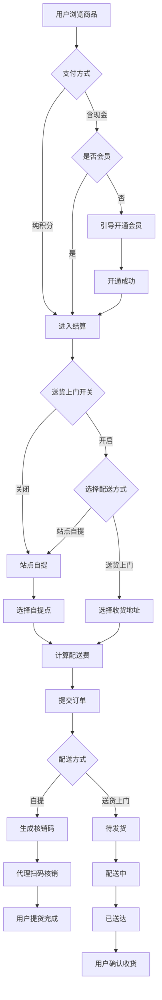
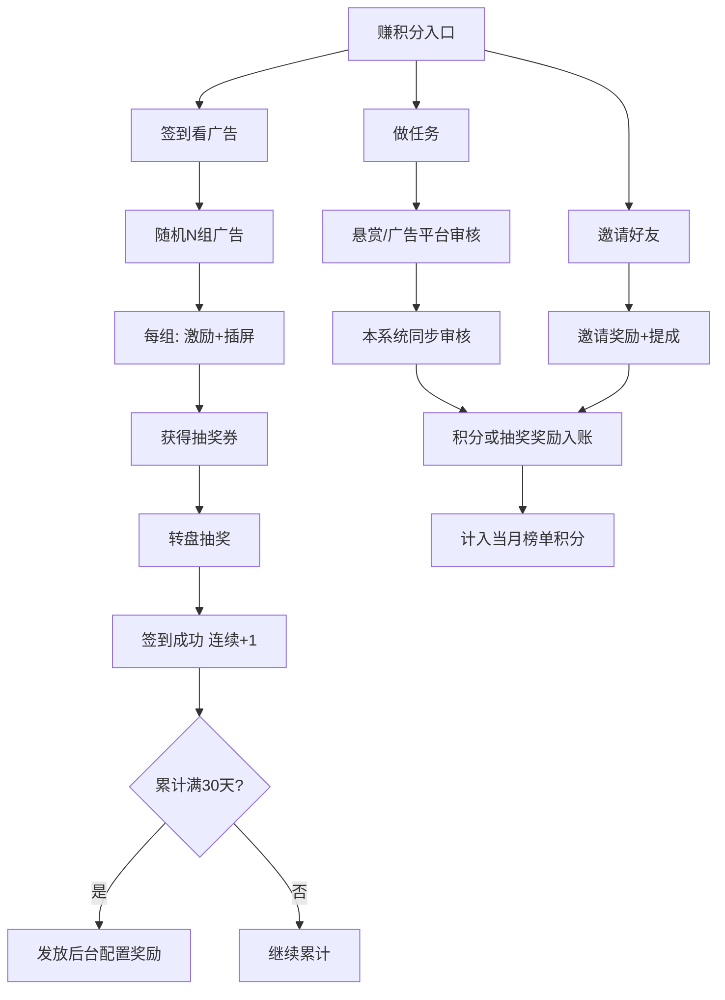
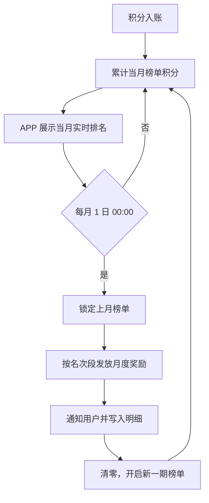

# TGG Shop 产品需求文档（PRD）

> **文档版本**：v1.8  
> **生成日期**：2026-06-22  
> **更新说明**：v1.8 补全自提点/配送团队数据结构、订单状态机、支付退款账务、后台权限与异常补偿机制  
> **来源文档**：《产品设计第二版.pdf》《新建 DOC 文档 (3).doc》《补充功能.doc》  
> **文档说明**：本文档基于产品设计稿与业务规则说明整理，用于指导 APP 开发、后台管理及平台自建配送/运营团队执行。

---

## 1. 项目概述

### 1.1 产品定位

TGG Shop 是一款集 **商城购物**、**积分体系**、**自提配送**、**送货上门**、**代理核销**、**邀请分销** 于一体的移动端电商应用。用户可通过签到、做任务、邀请好友等方式获取积分，并使用积分或现金购买商品；商品支持 **自提点取货**（代理扫码核销）与 **送货上门** 两种方式，其中送货上门服务由后台统一开关控制，可随时开启或关闭。

### 1.2 设计参考

| 模块 | 参考产品 |
|------|----------|
| 商城分类、商品列表 | 朴朴、京东 |
| 用户中心、订单状态 | 淘宝 |
| 代理核销流程 | 抖音（核销码模式） |
| 退货退款 | 朴朴、美团 |

### 1.3 目标用户

- **普通用户**：购物、赚积分、自提取货或送货上门；可使用积分兑换/消费，不可使用现金购物
- **会员用户**：已开通月会员的用户；除普通用户权益外，可使用现金购物或积分不足时现金补差
- **代理用户**：负责线下扫码核销订单
- **平台运营**：后台配置规则、审核任务、管理代理与配送

---

## 2. 信息架构与导航

### 2.1 底部 Tab 导航（5 个）

| Tab | 名称 | 说明 |
|-----|------|------|
| 1 | 首页 | 搜索、轮播、快捷入口、分类板块、热门推荐 |
| 2 | 赚积分 | **做任务** / **签到** 双 Tab |
| 3 | 商城分类 | 商品分类浏览 |
| 4 | 购物车 | 购物车管理 |
| 5 | 我的 | 个人中心与功能入口 |

---

## 3. 功能需求

### 3.1 首页模块

#### 3.1.1 定位

- 展示用户当前定位信息
- 定位用于匹配附近自提站点及送货上门服务范围

#### 3.1.2 产品搜索栏

- 支持关键词搜索商品
- 搜索结果跳转商品列表/详情

#### 3.1.3 滚动屏（轮播 Banner）

- 3 个展位轮播
- 支持后台配置图片与跳转链接

#### 3.1.4 积分快捷入口（3 个）

| 入口 | 功能 |
|------|------|
| 签到拿积分 | 跳转签到页 |
| 做任务拿积分 | 跳转任务列表 |
| 邀请好友拿积分 | 跳转邀请码/分享页 |

#### 3.1.5 首页内容板块

- 首页板块需层次分明，每个板块标题/用途清晰，用户能直观看出该板块用于积分、商品分类、热门推荐等场景
- 板块展示参考朴朴、叮咚买菜的首页分区方式
- 展示商品分类入口，下方展示产品分类/商品列表，分类内容由后台配置
- 首页各模块展示的数值、文案、入口顺序、分类内容等均支持后台配置

#### 3.1.6 产品热门栏

- 展示热门/推荐商品，可命名为「像热门推荐一样」的推荐板块
- 推荐商品、排序、展示数量由后台配置

#### 3.1.7 开屏广告

- 用户 **打开 APP** 时展示开屏广告（Splash Ad）
- 支持后台 **开启 / 关闭** 开屏广告
- 可配置：广告素材、展示时长（如 3–5 秒）、是否可跳过及跳过倒计时
- 开屏广告展示期间不阻塞必要初始化（定位、登录态等可在后台并行加载）

---

### 3.2 赚积分模块

赚积分 Tab 分为 **「做任务」** 与 **「签到」** 两个独立板块（顶部 Tab 切换）。

#### 3.2.1 做任务（对接悬赏平台 API）

> 接口文档：`api接口文档.txt` / `api接口文档 (4).pdf` · 实现参考：`app/earn-points.html`

| 页面 | 接口 | 说明 |
|------|------|------|
| 任务分类 | `index/index/task_type` | 顶部分类 Tab |
| 任务列表 | `index/index/task_list` | 支持 search、c_id 筛选、分页 |
| 任务详情 | `index/index/task_info` | 展示步骤 content、奖励、option |
| 提交任务 | `index/index/task_register` | 会员接任务交单 |
| 上传截图 | `/api/common/upload` | option 含 imgea 时 |
| 我的提交 | `index/index/get_examine_list` | 按 status 筛选审核状态 |
| 审核详情 | `/index/index/get_examine_info` | 查看单条交单记录、驳回理由与原任务信息 |
| 审核回调 | 平台回调 TGG 自建接口 | 接收 status / remarks / sf_uid / id，同步审核结果与积分 |

**列表页展示规则**（符合 UI 规范）：
- 展示：任务名称、小图、分类、提醒 tishi
- **不展示** reward / users_ratio（用户点击「去完成」进入详情后才可见奖励）

**详情页展示**：
- 任务金额 reward、会员可得 users_ratio
- 步骤图文 content、注意事项 tishi
- 暂停任务 is_pause 不可接

**会员接任务流程**：
```
选分类 → 浏览列表 → 任务详情 → 接任务 → 按 option 填表/上传 → 提交
→ 我的提交（审核中/通过/失败）→ 平台回调 → TGG 同步发积分
```

**option 动态表单**：

| option | 字段 |
|--------|------|
| name | 姓名 |
| mobile | 手机号 |
| text1 / text2 | 备注 |
| imgea | 截图（多图 upload 后逗号拼接） |

**鉴权**：所有请求携带 appid + sign（MD5(Ymd+appid+key)）；提交/审核查询携带 sf_uid（TGG 用户 ID）。

**页面设计与接口映射（8-3 已确认）**：

| 页面 | 页面内容 | 接口与交互 |
|------|----------|------------|
| 做任务首页 | 顶部搜索框、分类 Tab、任务卡片列表、加载/空状态 | 进入页先请求 `task_type` 渲染分类；默认或切换分类时请求 `task_list`，传 `page`、`count`、`search`、`c_id` |
| 任务列表卡片 | 任务小图、任务名称、分类名称、注意提醒、去完成按钮 | 使用 `task_list` 返回的 `id`、`title`、`image`、`c_name`、`tishi`；列表页不展示 `reward` / `users_ratio` |
| 任务详情页 | 任务标题、图标、分类、奖励、会员可得、任务步骤图文、注意事项 | 请求 `task_info`；安全渲染 `content.txt` 与 `img_list`；`is_pause=1` 时置灰按钮并提示任务暂停 |
| 任务提交页 | 根据任务 `option` 动态生成姓名、手机号、备注、截图上传表单 | `option` 含 `imgea` 时先走 `/api/common/upload`，多图 URL 用逗号拼接；提交 `task_register` |
| 我的提交页 | 全部、审核中、已通过、已失败 Tab；展示任务名、状态、奖励、提交时间 | 请求 `get_examine_list`，传 `status=All/0/1/2`、`sf_uid`、`page`；失败记录展示 `reasons` |
| 提交详情页 | 原任务信息、用户提交字段、截图、审核状态、驳回理由 | 请求 `get_examine_info`；审核失败时展示驳回原因，引导用户按平台规则重新提交或换任务 |
| 回调处理 | 平台审核后回调 TGG 后端，同步通过/驳回状态 | 接收 `id`、`sf_uid`、`status`、`remarks`；`status=1` 发放积分并计算邀请提成，`status=2` 写入驳回理由；返回 `{"status":"success"}` |

**交互规则**：
- 做任务入口仅面向会员交单；非会员点击「去完成」时先引导开通月会员。
- TGG 后端统一保存 `appid`、`key` 并生成 `sign`，APP 不直接暴露密钥。
- 任务列表、详情、提交、审核查询均通过 TGG 后端中转请求悬赏平台，便于统一日志、重试、异常处理与积分入账。
- 回调入账需按悬赏平台任务订单 `id` 做幂等校验，防止重复发积分。

#### 3.2.3 拉新任务（邀请好友）

> **不调用悬赏平台 API**，为 TGG 自有邀请分销逻辑，详见 §3.9；接口草案见 §4.5。

**入口位置**：做任务 Tab 顶部固定卡片「拉新任务 · 邀请好友」（与悬赏任务列表并列，位于分类 Tab 下方）。

**列表展示规则**（符合 UI-04）：
- 卡片仅展示任务名称与引导文案
- **不展示**「+3 积分」「10% 提成」等具体数值
- 用户点击「去完成 ›」进入 **我的邀请码** 页后，才展示奖励规则详情

**我的邀请码页**：
- 展示唯一邀请码、复制、分享（微信等）
- 展示奖励规则：邀请成功积分、任务提成比例、新用户 1 个月会员（数值后台可配置）
- 展示累计邀请人数、累计提成积分
- 展示邀请列表：被邀请人昵称、注册时间、贡献积分

**业务流程**：
```
分享邀请码 → 好友注册并绑定 → 邀请人 +N 积分
→ 被邀请人做任务获积分 → 邀请人获 M% 持续提成
→ 积分写入明细，可在邀请页查看贡献
```

**与悬赏任务的区别**：

| 维度 | 做任务（悬赏 API） | 拉新任务（TGG 自有） |
|------|-------------------|---------------------|
| 数据来源 | 悬赏平台 task_* 接口 | TGG 邀请/用户体系 |
| 奖励发放 | 平台审核回调 → TGG 发积分 | 注册绑定 + 任务提成，TGG 直接计算 |
| 列表展示 | 不展示 reward | 不展示具体积分/比例 |

#### 3.2.4 签到（看广告 + 抽奖）

- 与「做任务」板块 **独立**，不调用悬赏 task 接口
- 展示 **「签满 30 天送 XXX」**（后台配置），不使用「今日签到 +10 积分」
- 签到累计采用 **连续 30 天周期**：中间断签则从 0 重新计算
- 连续签满 30 天后发放后台配置奖品，并开启新的 30 天周期重新累计
- 签到页需展示当前周期已累计天数与距离满 30 天还差多少天，文案尽量清晰

##### 3.2.4.1 广告组规则

**一组 = 1 激励视频（激）+ 1 插屏广告（插）**，必须按顺序看完才算完成该组。

| 概念 | 说明 |
|------|------|
| 广告组 | 1 激 + 1 插，成对出现 |
| 当日组数 | 后台配置 **随机范围**（如 min=3、max=5），系统每日为用户随机抽取 N 组 |
| 当日总广告数 | N 组 × 2 = 2N 条（N 组则 N 个激 + N 个插） |

**示例**：后台设置 3–5 组，今日随机到 **4 组** → 用户需看完 **4 激 + 4 插**，共 8 条广告。

**签到页展示**：
- 「今日任务：观看 **N 组** 广告」
- 说明「每组 = 1 激励视频 + 1 插屏广告」
- **不前置展示** 抽奖具体奖励数值（与 UI-04 一致）

##### 3.2.4.2 看广告流程

```
点击「立即签到」→ 跳转/唤起广告 SDK
→ 第1组：激励视频 → 插屏广告
→ 第2组：激励视频 → 插屏广告
→ … 直至第 N 组完成
→ 发放抽奖券 ×1 → 展示抽奖转盘
→ 用户点击抽奖 → 按后台权重随机出奖 → 积分/奖品入账
→ 计入连续签到天数 +1
```

- 用户点击「立即签到」时 **自动跳转广告页**（或唤起广告 SDK）
- 进度页展示：当前第几组、当前是激/插、已完成条数 / 总条数
- 中途退出可续看（服务端记录进度，当日有效）
- 全部看完后 **签到成功**，连续天数 +1
- 若用户当日未完成签到或断签，连续签到计数清零，次日从第 1 天重新开始累计

##### 3.2.4.3 抽奖转盘

| 项 | 说明 |
|----|------|
| 获得条件 | 当日 N 组广告全部看完 |
| 抽奖券 | 每日完成广告任务获得 **1 张**（后台可配置是否允许多次） |
| 转盘奖品 | 后台配置奖品列表（如 5/10/20/50/100 积分、「谢谢参与」等） |
| 出奖规则 | 按 **权重随机**，具体数值与概率均由后台配置 |
| 展示 | 转盘扇区展示奖品名称；**具体奖励金额不在签到首页前置展示** |

##### 3.2.4.4 后台可配置项

| 配置项 | 说明 | 示例 |
|--------|------|------|
| ad_group_min | 每日广告组数下限 | 3 |
| ad_group_max | 每日广告组数上限 | 5 |
| streak_days | 连续签到满 N 天奖励 | 30 |
| streak_reward | 满 N 天奖励内容 | 100 积分 / 实物 |
| lottery_prizes | 转盘奖品及权重 | 见 §4.6 |
| lottery_daily_limit | 每日抽奖次数上限 | 1 |

---

### 3.3 商城分类模块

- 完整商品分类树
- 分类页、商品列表页参考朴朴、京东
- 支持按分类浏览、筛选、进入商品详情

---

### 3.4 购物车模块

- 添加/删除/修改商品数量
- 结算前校验会员状态、积分余额、配送费
- 跳转订单确认页

---

### 3.5 商品详情与购买规则

#### 3.5.1 支付方式与会员关系

| 支付方式 | 会员要求 | 价格 |
|----------|----------|------|
| 纯积分兑换 | **不需要**开通会员 | 享受会员价 |
| 现金购买 | **必须**开通会员 | 会员价 |
| 积分 + 现金补差 | **必须**开通会员 | 积分不足部分用现金补足 |

> 规则说明：只要涉及现金支付（含积分不足补差价），均须先开通会员。

#### 3.5.2 购买限额

- 每个账号 **每天最多购买 500 元** 商品（金额上限可在后台配置）

#### 3.5.3 现金购买引导

- 非会员用户使用现金购买时，弹窗/页面提醒开通会员
- 提供跳转 **微信** 或 **支付宝** 开通会员入口
- 会员费用后台可配置

---

### 3.6 会员体系

#### 3.6.1 新用户赠送

- 每个新用户注册当天起，**赠送 1 个月会员**
- 1 个月到期后会员卡失效，需重新开通才能激活

#### 3.6.2 会员开通方式

- 普通用户升级为会员的条件：必须开通 **月会员**
- 现金开通（微信/支付宝）
- **积分开通**（积分不足可现金补差）
- 月会员开通成功后，用户身份从普通用户升级为会员用户

#### 3.6.3 月卡倒计时

- 开通月卡会员后，从开通时刻起进入 **30 天** 倒计时
- 会员到期页面/状态需明确展示剩余天数

#### 3.6.4 会员与可提现余额

- 会员身份与可提现余额为两个独立权益/账户概念
- **会员** 用于判断现金购买、会员价、会员有效期等权益
- **可提现余额** 用于提现至微信，不等同于会员状态，也不因会员到期自动失效
- 用户端需分别展示会员状态/剩余天数与可提现余额，避免将两者混淆

#### 3.6.5 会员与非会员权益

- **普通用户与会员用户的核心差异：是否可使用现金购物**
- 普通用户：可通过积分进行兑换/消费；不可使用现金购买商品，也不可使用现金补差
- 会员用户：可使用现金购买商品；积分不足时可使用现金补差
- 纯积分兑换无需会员，仍按 §3.5.1 规则执行
- 新用户赠送 1 个月会员体验，到期后如需继续使用现金购物，需重新开通月会员

#### 3.6.6 招聘入口

- 「我的」页面增加 **XX 招聘** 入口（名称可后台配置）
- 点击后进入招聘说明页，展示当前需要招聘的职位、岗位说明、联系方式/客服入口等
- 招聘职位、说明文案、展示状态由后台配置

---

### 3.7 订单与配送

#### 3.7.1 配送方式总开关

系统预置 **站点自提** 与 **送货上门** 两种配送能力，均由后台独立开关控制：

| 开关 | 默认 | 说明 |
|------|------|------|
| **站点自提开关** | 开启 | 关闭后 APP 不展示自提相关选项 |
| **送货上门服务开关** | 关闭 | 开启后 APP 展示送货上门选项 |

- 至少一种配送方式开启时，用户方可完成下单；两者均关闭时，需提示「暂不支持下单」
- 开关状态实时生效，APP 根据配置动态展示配送方式

#### 3.7.2 配送方式选择

用户在 **订单确认页** 选择配送方式（取决于后台开关）：

| 配送方式 | 说明 | 可见条件 |
|----------|------|----------|
| **站点自提** | 到自提点凭核销码取货 | 自提开关开启 |
| **送货上门** | 配送至用户指定地址 | 送货上门开关开启 |

- 仅一种方式开启时，默认选中该方式，可不展示切换 Tab
- 两种方式均开启时，用户可自由选择
- 同一订单仅可选择一种配送方式，下单后不可更改

#### 3.7.3 站点自提（淘宝模式）

- 用户可 **填写/管理自己的联系地址**（姓名、手机号、地址信息），用于订单联系与展示
- **提货仍须到自提点** 凭核销码取货（淘宝模式：有地址信息，但履约方式为到站自提）
- 自提点 **详细地址由后台配置**，与用户端看到的自提点地址 **实时同步**
- 用户从系统预设 **自提站点列表** 中选择取货站点，不可将任意自定义门牌地址作为自提点
- 根据定位推荐自提站点，例如：定位到「师大」→ 推荐「师大站点」
- 下单后通过消息/订单页告知用户到哪个自提点取货
- **自提点仅承担核销功能**（代理扫码核销），不承担其他线下业务

**代理核销流程（仅自提订单）：**

```
用户下单 → 生成核销码 → 用户到自提点 → 代理扫码核销 → 用户提货
```

| 角色 | 行为 |
|------|------|
| 普通用户 | 每下一单生成一个核销码（类似抖音核销码） |
| 代理用户 | 进入「扫一扫」扫描用户核销码，核销完成后用户提货 |
| 非代理用户 | 打开代理功能时提示「您不是代理」 |

- 后台可设置哪些账号为代理
- 用户申请代理时，**跳转客服** 进行沟通与审批（见 §3.8.4）

#### 3.7.4 送货上门

**功能预置，由后台开关控制是否对用户可见。**

##### 履约团队

- 送货上门不对接第三方物流平台
- 平台自建配送团队，负责订单出库后的配送、送达和状态反馈
- 后台订单管理中展示配送员/配送团队信息，具体人员或团队由平台运营维护

##### 收货地址管理

- 用户可 **新增 / 编辑 / 删除** 收货地址
- 地址字段：收货人姓名、手机号、省市区、详细地址（门牌号）、可选地图选点定位
- 支持设置默认收货地址
- 结算时从地址列表选择，或新增地址
- 地址需在 **送货上门服务范围** 内，否则不可下单

##### 下单与配送

- 用户选择「送货上门」并确认收货地址
- 结算页展示送达日期与可选送货时间段（后台可配置是否展示、文案规则）
- 用户可在后台配置的时间段内自主选择送货上门时间，例如 **早上 09:00 到晚上 21:00**
- 具体可选时间段、时间粒度、是否支持当日送达/隔日送达均由后台配置
- **不生成自提核销码**，不走代理扫码核销流程
- 配送完成后，用户确认收货或系统自动确认（超时天数后台可配）

##### 送货上门订单状态

| 状态 | 说明 |
|------|------|
| 待发货 | 已支付，等待备货/出库 |
| 配送中 | 已发出，正在配送 |
| 已送达 | 配送完成，待用户确认或已自动确认 |
| 已收货 | 用户确认收货或超时自动确认 |

##### 消息通知

- 订单已发出 / 配送中 / 已送达 推送通知
- 可选：预计送达时间段提醒

#### 3.7.5 配送费规则

- 用户下单结算时，根据 **配送方式** 自动计算配送费
- **站点自提** 基本不收取配送费，默认配送费为 **0 元**；如后续运营需要，可由后台单独开启并配置
- **送货上门** 需要配送费，按后台配置的档位规则计算
- 默认档位示例：可配置为 **1 / 5 / 10 / 20 / 50 / 80** 等 6 个档位，具体门槛与费用由后台设置
- 后台可配置：
  - 是否启用配送费
  - 自提 / 送货上门各自是否收费（默认自提不收费、送货上门收费）
  - 各金额档位对应配送费
  - 满额免配送费门槛（可选）

#### 3.7.7 下单配送时段规则

用户 **提交订单时** 弹出 **配送时间说明**，明确当日配送或隔日配送规则。

##### 截单时间（后台可配置）

- 默认 **每日凌晨 05:00** 为截单分界点（可配置为其他时刻）
- 规则示例（假设截单点为 05:00）：

| 下单时间 | 预计配送日 |
|----------|------------|
| 11 日 05:00 ~ 12 日 05:00 前 | **12 日** 配送 |
| 12 日 05:00 ~ 13 日 05:00 前 | **13 日** 配送 |
| 13 日 05:00 ~ 14 日 05:00 前 | **14 日** 配送 |

##### 展示示例

- 13 日 **03:00** 下单 → 提示 **「13 号配送」**
- 13 日 **10:00** 下单 → 提示 **「14 号配送」**（已过当日截单点）

- 结算页/下单确认弹窗需 **醒目展示** 预计配送日期
- 送货上门订单还需展示用户选择的送货时间段
- 自提与送货上门订单 **共用同一套截单规则**（除非后台为两种方式分别配置）
- 截单时间点、文案模板均可后台配置

#### 3.7.8 订单状态与展示（统一）

- 订单列表参考淘宝：**待收货**、**已收货**
- 订单卡片/详情需展示 **配送方式标签**（站点自提 / 送货上门）
- **自提订单**：展示自提点详细地址、核销码（待核销时）
- **送货上门订单**：展示收货地址、配送进度、预计/实际送达时间
- 可选功能（后台可启用/隐藏）：展示预计配送日期（见 §3.7.7）

---

### 3.8 我的（个人中心）

#### 3.8.1 用户信息区

展示字段（参考淘宝）：

- 头像
- 名称
- 等级
- 积分
- 提现（见 §3.8.2）
- 开通会员

#### 3.8.2 提现

- 用户可将 **可提现余额** 提现至微信
- 可提现余额与积分余额、会员状态分开管理：积分用于兑换/消费，可提现余额用于提现
- 邀请奖励、任务提成等是否进入可提现余额由后台规则配置
- **最低提现金额：1 元起**（后台可配置）
- **手续费：1%**（后台可配置比例）
- 实际到账 = 提现金额 − 手续费
- 提现记录可在明细中查看
- 后台可配置：可提现来源、最低金额、手续费比例、每日提现次数/上限、审核方式（自动/人工）

#### 3.8.3 我的订单

- 待收货 / 已收货
- 展示 **配送方式**（站点自提 / 送货上门）
- **自提订单**：展示自提点详细地址、核销码入口
- **送货上门订单**：展示收货地址、配送进度
- 可选：显示预计送达/到站时间

#### 3.8.4 功能菜单

| 序号 | 功能 | 说明 |
|------|------|------|
| 1 | 我的邀请码 | 含分销机制，见 3.9 |
| 2 | 积分明细 | 积分收支流水 |
| 3 | 收货地址 | 用户联系地址管理；自提点选择（见 §3.7.3）；送货上门地址（见 §3.7.4） |
| 4 | 我的收藏 | 收藏的商品 |
| 5 | 意见反馈 | 用户反馈入口 |
| 6 | 商务合作 | 可留联系方式并说明合作类型 |
| 7 | 申请点位代理 | **跳转客服**，由客服沟通并协助完成代理申请 |
| 8 | 积分排行榜 | 见 3.10 |
| 9 | 客服 | 联系客服 |
| 10 | XX 招聘 | 展示招聘职位与说明，见 §3.6.6 |
| 11 | 纯积分兑换 | 积分兑换专区，见 §3.12 |

---

### 3.9 邀请分销机制

#### 3.9.1 邀请关系

- 每个用户拥有唯一邀请码
- 通过邀请码注册的用户与邀请人建立绑定关系

#### 3.9.2 邀请奖励（默认值，均可后台配置）

| 奖励类型 | 默认规则 | 后台参数 |
|----------|----------|----------|
| 邀请成功奖励 | 邀请人获得 **3 积分** | 可配置积分数量 |
| 持续提成 | 被邀请人做任务所得积分的 **10%** 奖励给邀请人 | 可配置提成比例 |

#### 3.9.3 我的邀请码页

- 展示邀请码与分享能力
- 展示：我邀请了谁、被邀请人积分贡献等
- 具体数值后台可配置

---

### 3.10 积分排行榜

- 按用户 **当月累计获得积分** 进行排名（仅统计本自然月内入账的积分，不含消费扣减）
- **每月 1 日 00:00** 自动执行 **榜单结算**：对 **上一自然月** 排行榜进行定榜、发放奖励，随后 **清零重新计算**，开启新一期月度榜单
- 即：**一个自然月为一期，每期奖励发放一次**
- 入口：我的 → 积分排行榜

#### 3.10.1 榜单周期规则

| 阶段 | 时间 | 说明 |
|------|------|------|
| 当期进行中 | 每月 1 日 00:00 结算后 ~ 当月末 | 用户赚积分实时累计，APP 展示 **当月实时排名** |
| 月度结算 | 每月 1 日 00:00 | 锁定上月榜单 → 发放奖励 → 当月积分计数归零，重新开始 |

- 例：3 月 1 日 00:00 结算 **2 月** 榜单并发放奖励，同时 3 月新一期榜单从 0 开始累计
- APP 需展示：**当前榜单期数**（如「2026 年 3 月榜」）、**距离下次结算**（如「还剩 12 天定榜」）

#### 3.10.2 月度奖励

- 根据 **上月最终排名** 发放奖励（积分、优惠券、实物等，具体规则 **后台可配置**）
- 支持配置：各名次段奖励内容（如第 1 名、第 2–10 名、第 11–50 名等）
- 奖励发放后写入积分明细/消息通知，用户可在排行榜页查看 **历史期数榜单** 及 **本人获奖记录**
- 若用户排名并列，按平台规则处理（后台可配置：并列同奖 / 按先到先得等）

#### 3.10.3 展示与刷新

- **当月排名**：积分变动后更新用户名次；APP 可定时刷新展示（刷新间隔 **后台可配置**，默认 5 分钟，仅影响页面展示，不影响月度结算周期）
- 展示 **最近一次榜单更新时间**
- 展示 **上月定榜结果**（结算完成后可查看）
- 每月 1 日结算期间，可展示「榜单结算中，请稍候」状态（结算任务应在合理时间内完成，如 30 分钟内）

#### 3.10.4 后台管理

- 开启/关闭积分排行榜功能
- 配置 **月度奖励规则**（名次段、奖励类型与数量）
- 配置 **榜单展示刷新间隔**（默认 5 分钟，仅影响 APP 展示频率）
- 查看/导出每期历史榜单
- 支持 **手动触发补结算**（异常情况下对指定期数重新定榜发奖，需操作日志）

---

### 3.11 退货退款

- 参考朴朴、美团退货流程
- 支持 **全额退款** 与 **部分退款**
- 退还的积分 **原路返还** 至用户账户
- 用户遇到退货问题时，优先联系 **客服** 沟通处理方案
- 沟通后由用户在订单中提交退货/退款申请，可选择退款或全退
- 用户提交申请后，后台进行 **人工审批**，审批通过后执行退款/退积分
- **自提订单**：未核销前可申请退款；已核销后需先联系客服，按后台审批结果处理
- **送货上门订单**：未发货可申请全额退款；配送中/已送达需先联系客服，按签收状态及后台审批结果处理

#### 3.11.1 退货退款流程

```
用户联系客服 → 沟通退货/退款原因 → 用户提交退款/全退申请
→ 后台人工审批 → 审批通过后退款/退积分 → 订单状态更新
```

---

### 3.12 纯积分兑换

- 增加 **纯积分兑换** 功能入口，可放置在「我的」页面或商城相关入口中
- 纯积分兑换商品仅使用积分支付，不涉及现金补差时不要求用户开通会员
- 兑换商品、所需积分、库存、兑换限制、上下架状态均由后台配置
- 兑换成功后扣减用户积分并生成兑换订单，订单履约方式沿用站点自提/送货上门配置
- 积分不足时提示用户积分不足，不展示现金补差入口；如需支持补差，应走 §3.5.1 的会员校验规则

---

## 4. 后台管理需求

### 4.1 可配置项汇总

| 配置项 | 说明 |
|--------|------|
| **站点自提开关** | 开启 / 关闭，控制 APP 是否展示自提选项 |
| **送货上门服务开关** | 开启 / 关闭，控制 APP 是否展示送货上门选项 |
| **自提点地址** | 后台维护详细地址，与用户端展示实时同步 |
| **下单截单时间** | 每日截单分界点（默认 05:00），决定当日/隔日配送 |
| **配送日期提示文案** | 下单时弹窗/结算页展示模板 |
| **开屏广告** | 开关、素材、时长、是否可跳过 |
| **签到看广告** | 广告组随机范围（min–max）、30 天签到奖励、转盘奖品与权重 |
| **连续签到周期** | 断签清零、满 30 天发奖后重新累计，奖励内容后台配置 |
| **签到抽奖** | 转盘奖品列表、各奖品权重、每日抽奖次数 |
| **提现规则** | 可提现来源、最低 1 元起、手续费 1%（均可配置）、提现至微信 |
| **送货服务范围** | 配送区域、半径或站点覆盖范围 |
| **送货上门配送费** | 默认收费；支持 1/5/10/20/50/80 等档位，门槛和费用后台配置 |
| **自提配送费规则** | 默认不收费；如运营需要可后台开启并配置 |
| **送货上门时间段** | 可选时间范围、时间粒度、当日/隔日规则，例如 09:00–21:00 |
| **预计送达时间规则** | 送货上门预计日期、时段文案与计算规则 |
| **自动确认收货天数** | 送货上门订单送达后 N 天自动确认 |
| **首页板块配置** | 板块标题、用途说明、排序、商品分类、热门推荐内容 |
| **招聘入口** | 是否展示、入口名称、职位、说明文案、联系方式/客服入口 |
| **纯积分兑换** | 兑换商品、所需积分、库存、兑换限制、上下架状态 |
| **退货退款审批** | 退款/全退申请、人工审批、审批状态与退款规则 |
| 轮播 Banner | 3 个展位内容与链接 |
| 商品与分类 | 商品、价格、库存、分类 |
| 每日购买上限 | 默认 500 元/账号/天 |
| 会员价格 | 月卡费用 |
| 代理账号 | 指定哪些用户为代理 |
| 邀请奖励 | 邀请积分、提成比例 |
| 自提配送提示 | 是否显示「次日配送时间+自提点」 |
| 商务合作 | 接收合作申请 |
| 任务/广告积分 | 任务数量（3–8 条随机）、奖励金额 |
| 积分排行榜 | 月度榜单开关、每月 1 日自动结算、名次段奖励规则、展示刷新间隔（默认 5 分钟） |

### 4.2 订单管理

- 订单列表、状态流转
- 按 **配送方式** 筛选：站点自提 / 送货上门
- **自提订单**：核销状态（待核销/已核销）、自提点信息
- **送货上门订单**：发货、配送中、已送达状态；收货地址；平台自建配送员/配送团队信息
- 支持后台手动更新配送状态（送货上门）

### 4.3 用户管理

- 用户列表、会员状态
- 代理资格审批
- 积分调整与流水查询

### 4.4 审核对接

- 与悬赏任务平台对接：对方审核通过后，本系统同步通过并发放积分
- 发放被邀请人任务积分时，同步计算邀请人 **M% 提成**（默认 10%，后台可配置）
- 开屏广告与签到广告的 SDK / 广告后台可由同一运营或技术团队统一维护，无需拆分为两套独立团队
- 悬赏任务平台接口方案按 `api接口文档.txt` 执行：使用 `appid + sign` 鉴权，响应遵循 `{ code, msg, data }`
- 平台回调由 TGG 后端提供接收地址，接收 `id`、`sf_uid`、`status`、`remarks`，审核通过后写入积分流水，审核驳回后写入驳回原因
- 后台需记录接口请求日志、回调日志、积分发放日志，便于排查提交失败、审核失败、重复回调等问题

### 4.5 TGG 邀请 API（草案）

> 实现参考：`app/js/invite-api.js`、`app/earn-points.html`（我的邀请码页）  
> 与悬赏平台 API **独立**，由 TGG 后端提供。

**基础约定**：

| 项 | 说明 |
|----|------|
| 协议 | HTTP POST |
| 编码 | UTF-8 |
| 鉴权 | 登录态 token + uid（与 APP 用户体系一致） |
| 响应 | `{ code: 0, msg, data }`，code=0 成功 |

#### 4.5.1 邀请信息 `POST /api/invite/info`

**请求**：`uid`, `token`

**响应 data**：

| 字段 | 类型 | 说明 |
|------|------|------|
| invite_code | string | 用户唯一邀请码 |
| share_url | string | 带邀请码的分享链接 |
| share_title | string | 分享文案标题 |
| reward_invite | number | 邀请成功奖励积分（默认 3） |
| reward_ratio | number | 任务提成比例 %（默认 10） |
| total_invited | number | 累计邀请人数 |
| total_commission | number | 累计提成积分 |

#### 4.5.2 邀请列表 `POST /api/invite/list`

**请求**：`uid`, `token`, `page`, `count`

**响应 data**：数组

| 字段 | 说明 |
|------|------|
| uid | 被邀请人用户 ID |
| nickname | 昵称 |
| avatar | 头像 URL |
| bind_time | 绑定/注册时间 |
| contributed | 累计贡献积分（提成来源） |

#### 4.5.3 邀请统计 `POST /api/invite/stats`（可选）

**响应 data**：`month_invited`, `month_commission`, `lifetime_invited`, `lifetime_commission`

#### 4.5.4 注册绑定（服务端）

- 用户注册时可选填 **invite_code**
- 校验邀请码有效且不可自邀、不可重复绑定
- 绑定成功后：被邀请人赠送 1 个月会员；邀请人获得 **reward_invite** 积分
- 被邀请人通过悬赏任务获得积分并入账时，按 **reward_ratio** 给邀请人发提成
- 所有变动写入积分流水，类型区分「邀请奖励」「邀请提成」

### 4.6 TGG 签到 API（草案）

> 实现参考：`app/js/signin-api.js`、`app/earn-points.html`（签到 Tab）  
> 对接广告 SDK 时，`ad_complete` 由客户端在广告回调成功后上报。

#### 4.6.1 签到状态 `POST /api/signin/status`

**响应 data**：

| 字段 | 说明 |
|------|------|
| group_count | 今日已确定的广告组数 N |
| group_min / group_max | 后台配置随机范围 |
| streak_days | 当前连续签到天数 |
| streak_reward_text | 展示文案，如「签满 30 天送 100 积分」 |
| signed_today | 今日是否已完成广告任务 |
| lottery_available | 是否有未使用的抽奖券 |
| prizes | 转盘奖品列表（label、weight） |

#### 4.6.2 开始签到 `POST /api/signin/start`

- 若当日尚未生成组数，服务端在 `[group_min, group_max]` 内随机 N
- 返回 `group_count`、`current_group=1`、`current_step=ji`

#### 4.6.3 广告完成上报 `POST /api/signin/ad_complete`

**请求**：`group_index`, `ad_type`（`ji` 激励 / `cha` 插屏）

**逻辑**：
- 同一组内必须先 `ji` 后 `cha`
- 全部 N 组完成后：`signed_today=true`，`lottery_ticket=1`，`streak_days+1`
- 返回下一组/下一步或 `finished=true`

#### 4.6.4 抽奖 `POST /api/signin/lottery_spin`

- 消耗当日抽奖券，按 `lottery_prizes` 权重随机
- 返回 `prize_id`、`prize_label`、`prize_value`，并写入积分流水

#### 4.6.5 转盘奖品配置（后台）

```json
[
  { "id": 1, "label": "5 积分", "value": 5, "weight": 30 },
  { "id": 2, "label": "10 积分", "value": 10, "weight": 25 },
  { "id": 6, "label": "谢谢参与", "value": 0, "weight": 2 }
]
```

---

## 5. 非功能需求

### 5.1 性能

- 当月榜单展示刷新延迟不超过后台配置的展示刷新间隔
- 每月 1 日榜单结算任务需稳定执行，避免重复发奖或漏发
- 首页、分类页加载流畅，参考主流电商体验

### 5.2 支付

- 支持微信支付、支付宝支付（会员开通、商品现金支付）

### 5.3 消息通知

- **自提订单**：自提点取货提醒、核销成功通知
- **送货上门订单**：已发货、配送中、已送达通知
- 可选：次日配送/送达时间通知
- 订单状态变更通知

### 5.4 安全

- 核销码一次性或时效性校验，防止重复核销
- 代理权限严格校验
- 支付与积分变动需有完整日志

---

## 6. 页面清单（开发用）

| 页面 | 优先级 | 备注 |
|------|--------|------|
| 首页 | P0 | 含搜索、轮播、快捷入口、分类板块、热门推荐；板块用途清晰 |
| 开屏广告 | P1 | 打开 APP 展示，后台可关闭 |
| 赚积分-做任务 | P0 | 对接 task_type/list/info/register/examine API；含分类、搜索、列表、详情、动态交单、我的提交、审核详情与拉新入口卡片 |
| 赚积分-拉新 | P0 | 我的邀请码页，对接 TGG invite API（§4.5） |
| 赚积分-签到 | P0 | 看广告签到（激+插成组）+ 抽奖转盘 |
| 商城分类 | P0 | 参考朴朴 |
| 商品详情 | P0 | |
| 购物车 | P0 | |
| 订单确认/结算 | P0 | 含配送方式、截单配送日提示、送货时间段、配送费、会员校验 |
| 我的 | P0 | |
| 我的订单 | P0 | 区分自提/送货上门展示 |
| 我的邀请码 | P0 | 赚积分-做任务内入口；含分享、邀请列表、奖励规则 |
| 积分明细 | P1 | |
| 自提点选择 | P0 | 从预设站点列表选择 |
| 收货地址管理 | P0 | 送货上门地址增删改；开关关闭时入口可隐藏或仅管理 |
| 积分排行榜 | P1 | 月度周期，每月 1 日结算发奖并重置 |
| 代理扫一扫核销 | P1 | 仅代理可见 |
| 申请点位代理 | P2 | 跳转客服 |
| 提现 | P1 | 最低 1 元，手续费 1%，提到微信 |
| 商务合作 | P2 | |
| 意见反馈 | P2 | |
| 客服 | P1 | |
| 会员开通 | P0 | 微信/支付宝/积分 |
| 退货申请 | P1 | 先联系客服，用户提交退款/全退申请，后台人工审批 |
| XX 招聘 | P2 | 展示招聘职位、说明与客服/联系方式 |
| 纯积分兑换 | P1 | 积分兑换专区，商品与兑换规则后台配置 |

---

## 7. 核心规则与边界补充

### 7.1 自提点与配送团队数据结构

#### 7.1.1 自提点 `pickup_site`

| 字段 | 类型 | 必填 | 说明 |
|------|------|------|------|
| id | bigint | 是 | 自提点 ID |
| site_code | string | 是 | 自提点编码，后台生成，唯一 |
| site_name | string | 是 | 自提点名称，如「师大站点」 |
| contact_name | string | 否 | 自提点联系人 |
| contact_mobile | string | 否 | 联系电话 |
| province / city / district | string | 是 | 省市区 |
| address_detail | string | 是 | 后台维护的详细地址，用户端展示需完全一致 |
| longitude / latitude | decimal | 否 | 经纬度，用于定位推荐 |
| service_scope | json | 否 | 覆盖范围，可存半径、行政区或多边形 |
| agent_user_ids | json | 否 | 可扫码核销的代理用户 ID 列表 |
| business_hours | string | 否 | 营业/提货时间 |
| status | enum | 是 | enabled / disabled |
| sort | int | 否 | 展示排序 |
| created_at / updated_at | datetime | 是 | 创建/更新时间 |

**规则**：
- 自提点由后台统一维护，APP 不允许用户自定义任意门牌地址作为自提点。
- 自提点关闭后，APP 不再展示该站点；已下单订单仍保留原自提点快照。
- 订单需保存 `pickup_site_snapshot`，包括自提点名称、详细地址、联系人、电话，避免后台地址变更影响历史订单。
- 自提点仅承担核销功能，不承担客服、售后、配送调度等其他线下业务。

#### 7.1.2 配送团队 `delivery_team`

| 字段 | 类型 | 必填 | 说明 |
|------|------|------|------|
| id | bigint | 是 | 配送团队 ID |
| team_name | string | 是 | 团队名称 |
| manager_name / manager_mobile | string | 否 | 负责人信息 |
| service_scope | json | 否 | 服务区域、半径或站点覆盖范围 |
| status | enum | 是 | enabled / disabled |
| remark | string | 否 | 备注 |
| created_at / updated_at | datetime | 是 | 创建/更新时间 |

#### 7.1.3 配送员 `delivery_staff`

| 字段 | 类型 | 必填 | 说明 |
|------|------|------|------|
| id | bigint | 是 | 配送员 ID |
| team_id | bigint | 是 | 所属配送团队 |
| name | string | 是 | 姓名 |
| mobile | string | 是 | 手机号 |
| avatar | string | 否 | 头像 |
| work_status | enum | 是 | online / offline / busy / rest |
| service_scope | json | 否 | 个人可配送范围 |
| current_order_count | int | 否 | 当前配送单数 |
| status | enum | 是 | enabled / disabled |
| created_at / updated_at | datetime | 是 | 创建/更新时间 |

**配送分配规则**：
- 送货上门订单支付成功后进入待发货；后台可手动分配配送团队/配送员。
- 若开启自动分配，可按服务范围、当前单量、在线状态进行分配；自动分配失败时进入「待分配」。
- 配送订单需保存 `delivery_staff_snapshot`，包括配送员姓名、手机号、团队名称，便于历史追溯。
- 本项目不对接第三方物流，不生成第三方物流单号。

---

### 7.2 订单状态机

#### 7.2.1 主订单状态 `order_status`

| 状态 | 说明 | 可进入来源 | 可流转至 |
|------|------|------------|----------|
| pending_pay | 待支付 | 提交订单（含现金） | paid / cancelled |
| paid | 已支付/已扣积分 | 支付成功、纯积分扣减成功 | pending_pickup / pending_ship / refunding / cancelled |
| pending_pickup | 待自提/待核销 | 自提订单支付完成 | picked_up / refunding |
| picked_up | 已核销/已提货 | 代理扫码核销 | completed / refunding |
| pending_ship | 待发货 | 送货上门订单支付完成 | shipping / refunding |
| shipping | 配送中 | 后台发货/配送员接单 | delivered / refunding |
| delivered | 已送达 | 配送员或后台更新送达 | completed / refunding |
| completed | 已完成 | 用户确认收货、核销完成或自动确认 | closed |
| refunding | 退款/售后中 | 用户提交退款/全退申请 | refunded / paid / pending_pickup / pending_ship / shipping / delivered |
| refunded | 已退款/已退积分 | 退款审批并执行成功 | closed |
| cancelled | 已取消 | 待支付取消、超时取消、后台取消 | closed |
| closed | 已关闭 | 终态归档 | - |

#### 7.2.2 配送方式子状态

| 配送方式 | 子状态 | 说明 |
|----------|--------|------|
| 站点自提 | verification_pending | 待核销 |
| 站点自提 | verified | 已核销 |
| 站点自提 | verification_expired | 核销码过期（如后台启用有效期） |
| 送货上门 | assign_pending | 待分配配送员 |
| 送货上门 | assigned | 已分配 |
| 送货上门 | shipping | 配送中 |
| 送货上门 | delivered | 已送达 |
| 送货上门 | delivery_exception | 配送异常 |

#### 7.2.3 状态约束

- `pending_pay` 未支付订单不扣减现金，但可冻结库存；超过支付有效期自动取消并释放库存。
- 纯积分兑换订单提交成功即扣减积分，进入 `paid`，再按履约方式进入自提或送货状态。
- 自提订单未核销前可申请退款；已核销后需联系客服并走人工审批。
- 送货上门订单未发货可申请全额退款；配送中/已送达需先联系客服，后台按签收状态审批。
- `completed` 后默认不允许普通退款；如需处理，必须由客服创建售后工单并后台审批。
- 所有状态变更必须写入 `order_status_log`，记录操作人、来源、前后状态、原因、时间。

---

### 7.3 支付、退款与账务规则

#### 7.3.1 支付单 `payment_order`

| 字段 | 类型 | 说明 |
|------|------|------|
| id | bigint | 支付单 ID |
| pay_no | string | 支付单号，唯一 |
| order_id | bigint | 关联订单 |
| user_id | bigint | 用户 ID |
| pay_scene | enum | goods_cash / member_open / cash_diff |
| pay_channel | enum | wechat / alipay |
| cash_amount | decimal | 现金金额 |
| point_amount | int | 使用积分 |
| status | enum | pending / success / failed / cancelled / refunded / partial_refunded |
| third_trade_no | string | 微信/支付宝交易号 |
| callback_time | datetime | 支付回调时间 |
| created_at / updated_at | datetime | 创建/更新时间 |

#### 7.3.2 积分流水 `point_ledger`

| 字段 | 类型 | 说明 |
|------|------|------|
| id | bigint | 流水 ID |
| user_id | bigint | 用户 ID |
| change_type | enum | signin / lottery / task_reward / invite_reward / invite_commission / shopping_deduct / exchange_deduct / refund_return / manual_adjust / ranking_reward |
| direction | enum | in / out |
| points | int | 变动积分 |
| balance_after | int | 变动后余额 |
| related_order_id | bigint | 关联订单，可为空 |
| related_task_order_id | string | 关联悬赏任务订单，可为空 |
| remark | string | 备注 |
| created_at | datetime | 创建时间 |

#### 7.3.3 可提现余额流水 `withdrawable_ledger`

| 字段 | 类型 | 说明 |
|------|------|------|
| id | bigint | 流水 ID |
| user_id | bigint | 用户 ID |
| change_type | enum | task_commission / invite_commission / withdraw_freeze / withdraw_success / withdraw_fail_return / manual_adjust |
| direction | enum | in / out / freeze / unfreeze |
| amount | decimal | 金额 |
| balance_after | decimal | 变动后余额 |
| related_id | string | 关联任务、邀请、提现单等 |
| remark | string | 备注 |
| created_at | datetime | 创建时间 |

#### 7.3.4 退款单 `refund_order`

| 字段 | 类型 | 说明 |
|------|------|------|
| id | bigint | 退款单 ID |
| refund_no | string | 退款单号，唯一 |
| order_id | bigint | 关联订单 |
| user_id | bigint | 用户 ID |
| refund_type | enum | full / partial |
| refund_cash_amount | decimal | 退现金额 |
| refund_point_amount | int | 退积分 |
| reason | string | 用户申请原因 |
| proof_images | json | 凭证图片 |
| status | enum | pending / approved / rejected / refunding / success / failed |
| audit_user_id | bigint | 审批人 |
| audit_remark | string | 审批备注 |
| created_at / updated_at | datetime | 创建/更新时间 |

#### 7.3.5 账务规则

- 含现金支付必须先校验会员状态；非会员不得创建现金商品支付单。
- 会员开通支付成功后，立即写入会员有效期；月会员从支付成功时刻起计算 30 天。
- 现金支付以第三方支付回调成功为准；支付回调需按 `pay_no` 幂等处理。
- 积分支付/纯积分兑换在订单提交成功时扣减；失败或取消时原路退回积分。
- 混合支付退款时，现金和积分分别原路退回；退款成功后分别写支付退款记录和积分流水。
- 排行榜积分只统计指定入账类型，默认统计签到、抽奖、任务奖励、邀请奖励、邀请提成、月榜奖励；购物扣减和退款返还不反向影响已结算历史榜单。
- 提现申请提交后冻结对应可提现余额；提现成功扣减冻结金额，提现失败解冻返还。
- 所有财务、积分、提现、退款动作必须具备唯一业务单号和幂等键。

---

### 7.4 后台角色与权限边界

| 角色 | 权限范围 | 关键限制 |
|------|----------|----------|
| 超级管理员 | 全部后台功能、角色授权、系统配置 | 仅少数管理账号 |
| 运营管理员 | 首页配置、Banner、商品分类、活动、签到广告、排行榜配置 | 不可审批提现，不可改财务流水 |
| 商品管理员 | 商品、分类、库存、纯积分兑换商品 | 不可处理退款和提现 |
| 订单管理员 | 订单查询、发货、配送状态更新、核销记录查看 | 不可直接改支付金额和积分余额 |
| 配送调度 | 配送团队、配送员、送货订单分配、配送异常处理 | 仅可处理送货上门订单 |
| 客服 | 查看订单/用户、创建售后工单、记录沟通、协助代理申请 | 不可直接审批退款/提现 |
| 财务 | 提现审批、退款审批、账务流水查询、支付退款处理 | 不可修改商品和活动规则 |
| 代理管理员 | 代理账号设置、自提点代理绑定、代理申请处理 | 不可审批提现和退款 |
| 审核运维 | 悬赏任务接口日志、回调重试、异常任务处理 | 不可手动发放非任务相关积分 |

**权限规则**：
- 后台所有写操作必须记录 `admin_operation_log`，包括操作人、角色、操作对象、变更前后值、IP、时间。
- 财务类操作（提现通过、退款通过、手动积分调整）建议支持二次确认；大额操作可配置二级审批。
- 客服只能创建/备注工单，不直接完成退款、提现、积分调整。
- 代理用户与后台管理员账号分离；代理扫码核销不等同于后台登录权限。

---

### 7.5 异常补偿机制

| 场景 | 处理规则 | 后台入口 |
|------|----------|----------|
| 支付成功但订单未更新 | 通过支付回调幂等重放或主动查询支付结果，成功后补写订单状态 | 支付异常日志 |
| 支付未完成超时 | 自动取消订单，释放库存和优惠/积分冻结 | 订单管理 |
| 积分扣减成功但订单创建失败 | 自动回滚积分；回滚失败进入人工补偿队列 | 积分异常日志 |
| 悬赏平台重复回调 | 按任务订单 ID + status 幂等处理，不重复发积分 | 任务审核日志 |
| 悬赏平台回调失败 | 记录失败原因，支持后台手动重试/标记处理 | 回调日志 |
| 广告看完但未上报 | 客户端可重试上报；服务端按用户、日期、组、广告类型幂等 | 签到日志 |
| 核销码重复扫码 | 服务端拒绝重复核销，返回已核销信息 | 核销日志 |
| 核销码过期 | 提示用户联系客服或重新下单；后台可人工处理 | 订单管理/客服工单 |
| 配送员误点送达 | 后台可回退至配送中，并记录原因 | 配送异常 |
| 配送超时/拒收 | 标记配送异常，由客服介入后决定重送、退款或关闭 | 配送异常/售后 |
| 退款审批通过但退款失败 | 退款单进入 failed，财务可重试或改人工处理 | 退款审批 |
| 提现失败 | 解冻可提现余额，记录失败原因并通知用户 | 提现审批 |
| 库存不足 | 下单前校验库存；已支付后发现缺货需客服介入退款或换货 | 库存异常 |

**统一要求**：
- 所有补偿操作必须有日志、操作人和原因。
- 自动重试需设置次数上限；超过上限进入人工处理队列。
- 用户侧需要通过消息通知反馈关键异常结果，如退款成功、提现失败、配送异常、任务驳回。
- 人工补偿不得直接改数据库，应通过后台功能产生业务单据和流水。

---

## 8. 业务流程图

### 8.1 下单与履约


```mermaid
flowchart TD
    A[用户浏览商品] --> B{支付方式}
    B -->|纯积分| C[进入结算]
    B -->|含现金| D{是否会员}
    D -->|否| E[引导开通会员]
    E --> F[开通成功]
    D -->|是| C
    F --> C
    C --> G{送货上门开关}
    G -->|关闭| H[站点自提]
    G -->|开启| I{选择配送方式}
    I -->|站点自提| H
    I -->|送货上门| J[选择收货地址]
    H --> K[选择自提点]
    K --> L[计算配送费]
    J --> L
    L --> M[提交订单]
    M --> N{配送方式}
    N -->|自提| O[生成核销码]
    O --> P[代理扫码核销]
    P --> Q[用户提货完成]
    N -->|送货上门| R[待发货]
    R --> S[配送中]
    S --> T[已送达]
    T --> U[用户确认收货]
```

### 8.2 积分获取


```mermaid
flowchart TD
    A[赚积分入口] --> B[签到看广告]
    A --> C[做任务]
    A --> D[邀请好友]
    B --> B1[随机N组广告]
    B1 --> B2[每组: 激励+插屏]
    B2 --> B3[获得抽奖券]
    B3 --> B4[转盘抽奖]
    B4 --> B5[签到成功 连续+1]
    B5 --> B6{累计满30天?}
    B6 -->|是| B7[发放后台配置奖励]
    B6 -->|否| B8[继续累计]
    C --> E[悬赏/广告平台审核]
    E --> F[本系统同步审核]
    F --> G[积分或抽奖奖励入账]
    D --> H[邀请奖励+提成]
    H --> G
    G --> I[计入当月榜单积分]
```

### 8.3 积分排行榜月度结算


```mermaid
flowchart TD
    A[积分入账] --> B[累计当月榜单积分]
    B --> C[APP 展示当月实时排名]
    C --> D{每月 1 日 00:00}
    D -->|否| B
    D -->|是| E[锁定上月榜单]
    E --> F[按名次段发放月度奖励]
    F --> G[通知用户并写入明细]
    G --> H[清零，开启新一期榜单]
    H --> B
```

---

## 9. 待确认事项（Open Questions）

1. 用户等级体系已确认：普通用户升级为会员需开通月会员；普通用户与会员用户的核心权益差异为是否可使用现金购物。
2. 自提点数据结构与站点管理后台已确认：见 §7.1 自提点与配送团队数据结构。
3. 悬赏任务平台 API 对接已确认：按 `api接口文档.txt` 设计做任务首页、任务详情、动态提交、我的提交、审核详情与回调同步；广告后台由同一团队维护，具体广告 SDK 配置归入广告模块执行。
4. 送货上门已确认：不对接第三方物流，由平台自建配送团队履约。
5. 开屏广告与签到广告已确认：可由同一个团队统一负责 SDK / 后台维护。

---

## 10. UI/UX 设计要求

| 编号 | 要求 | 说明 |
|------|------|------|
| UI-01 | 布局间距 | 各模块/卡片间距适当拉开，层次分明，避免元素挤在一起 |
| UI-02 | 自提点地址 | 后台配置详细地址，与用户端展示完全一致、实时同步 |
| UI-03 | 我的页入口 | 参考 ui02 / pupo-v12 上半部分第一个申请点位入口样式；下半部分从「我的邀请码」开始延续原有入口结构 |
| UI-04 | 赚积分页 | 任务不前置展示积分；签到展示「签满30天送XXX」；抽奖奖励进转盘后可见 |
| UI-05 | 首页板块 | 每个板块标题/用途清楚，能看出积分、商品分类、热门推荐等用途；分类与推荐内容后台可配置 |

---

## 11. 版本记录

| 版本 | 日期 | 说明 |
|------|------|------|
| v1.8 | 2026-07-05 | 补全自提点/配送团队数据结构、订单状态机、支付退款账务、后台权限、异常补偿机制 |
| v1.6 | 2026-06-29 | 根据《问题》截图补充送货时间段、连续签到、招聘、提现账户、退货审批、纯积分兑换、首页展示与后台配置规则 |
| v1.5 | 2026-06-23 | 签到：激+插成组、随机组数、抽奖券+转盘；§4.6 签到 API |
| v1.4 | 2026-06-23 | 拉新任务入口与我的邀请码页；§3.2.4 与 TGG 邀请 API 草案 |
| v1.3 | 2026-06-23 | 对接悬赏 API；赚积分拆分为做任务/签到双板块 |
| v1.2 | 2026-06-22 | 基于《补充功能.doc》：提现、签到看广告、配送时段等 |
| v1.1 | 2026-06-22 | 新增送货上门服务；积分排行榜改为月度周期 |
| v1.0 | 2026-06-22 | 基于《产品设计第二版.pdf》与《新建 DOC 文档 (3).doc》首次整理 |
